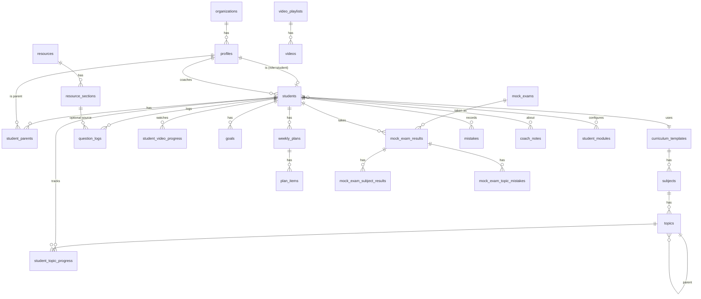

# Veri Modeli

> Bu belge referanstır; gerçek şema `supabase/migrations/` altındaki dosyalardır. Tablolar fazlara göre ayrı migration dosyalarında oluşturulur. Buradaki DDL taslakları kolon adları, tipler ve kısıtlar için bağlayıcıdır; küçük iyileştirmeler yapılabilir ama belge de güncellenmelidir.

## 1. Genel Kurallar

- Tüm tablolar `public` şemasında; yardımcı güvenlik fonksiyonları `private` şemasında.
- Birincil anahtar: `id uuid primary key default gen_random_uuid()` (bağlantı tabloları hariç, onlarda bileşik anahtar).
- Her tabloda `created_at timestamptz not null default now()`; değişebilen tablolarda `updated_at` + `private.set_updated_at()` tetikleyicisi (trigger fonksiyonu `private`'tadır: API'ye açık değildir, hiçbir role execute verilmez; tetiklenirken execute denetlenmez).
- Tablo ve kolon adları İngilizce, `snake_case`, tablo adları çoğul.
- Enum değerleri İngilizce; Türkçe karşılıkları `src/content/labels.ts` içinde.
- Öğrenciye bağlı her tablo `student_id uuid not null references students(profile_id) on delete cascade` içerir → öğrenci silinince tüm verisi gider (KVKK silme hakkı).
- Her yabancı anahtar kolonuna indeks eklenir.
- **Her tabloda RLS açıktır.** RLS'si olmayan tablo migration incelemesinden geçmez.
- Politikalarda `auth.uid()` doğrudan değil `(select auth.uid())` biçiminde yazılır (Postgres sorgu başına bir kez hesaplar, performans için).

## 2. İlişki Diyagramı (özet)



## 3. Enum Tipleri

```sql
create type user_role            as enum ('owner', 'coach', 'student', 'parent');
create type student_status       as enum ('active', 'paused', 'archived');
create type parent_relation      as enum ('mother', 'father', 'guardian', 'other');
create type consent_type         as enum ('privacy_notice', 'explicit_consent', 'photo_upload');
create type topic_status         as enum ('not_started', 'studying', 'completed', 'needs_review', 'mastered');
create type busy_slot_kind       as enum ('school', 'tutoring_center', 'private_lesson', 'course', 'other');   -- Faz 4a
create type resource_type        as enum ('lecture_book', 'question_bank', 'worksheet', 'booklet', 'mock_book', 'other');   -- Faz 7a ✅ (faz7a_enums)
create type question_source      as enum ('resource', 'plan', 'school', 'online', 'free');
create type goal_metric          as enum ('questions');           -- Faz 3 sade (02 karar #32); ileride add value
create type goal_period          as enum ('daily', 'weekly');     -- Faz 3 sade; 'monthly', 'custom' gerekince eklenir
create type plan_status          as enum ('draft', 'published');
create type plan_item_kind       as enum ('topic_study', 'questions', 'review', 'link', 'custom', 'section', 'video');   -- Faz 4b (karar A13); Faz 7a add value 'section', 'video' ✅
create type topic_alert_kind     as enum ('knowledge_gap', 'low_accuracy', 'review_due', 'forgetting_risk', 'stale', 'not_started', 'neglected_subject', 'behind_school');   -- Faz 4c; 4d suggestion_dismissals.kind; Faz 5a add value 'behind_school'
create type mistake_reason       as enum ('knowledge_gap', 'attention', 'time', 'misread_question', 'calculation', 'unknown');   -- Faz 6b ✅
-- topic_alert_kind: Faz 6b add value 'mock_weak' ✅ (10 §1.1; faz6b_mistakes)
create type mistake_status       as enum ('open', 'solved');           -- Faz 6b ✅; 'reviewing' tekrar sistemiyle add value (Faz 6b sonra)
create type note_visibility      as enum ('coach_only', 'student', 'parent', 'student_and_parent');   -- Faz 8 ✅ (faz8a)
create type notification_type    as enum ('plan_published', 'note_added', 'announcement', 'mock_result_added', 'student_note', 'review_due', 'student_inactive', 'weekly_summary');   -- Faz 8 ✅ (faz8b)
create type session_kind         as enum ('pomodoro', 'free', 'video', 'review', 'reading');
```

## 4. Tablolar

### 4.1 Kimlik ve Kurum (Faz 1)

```sql
organizations (
  id uuid pk,
  name text not null,
  slug text unique not null,
  settings jsonb not null default '{}',   -- uyarı eşikleri, tekrar aralıkları, sıralama tablosu açık mı
  created_at, updated_at
)

profiles (
  id uuid pk references auth.users(id) on delete cascade,
  organization_id uuid not null references organizations(id),
  role user_role not null,
  full_name text not null,
  username text unique,                   -- check: ~ '^[a-z0-9._]{3,30}$' ve (role = 'student') = (username is not null)
  avatar_url text,
  phone text,
  last_seen_at timestamptz,
  notification_prefs jsonb not null default '{}',   -- Faz 8: {"<bildirim türü>": false} kapalı; anahtar yoksa açık (check: nesne); kendi satırında kolon grant'ı
  created_at, updated_at
)

students (
  profile_id uuid pk references profiles(id) on delete cascade,
  organization_id uuid not null references organizations(id),
  coach_id uuid not null references profiles(id),
  curriculum_template_id uuid references curriculum_templates(id),  -- Faz 2: FK; nullable kaldı (karar #28), form zorunlu tutar
  season text not null,                   -- '2026-2027'
  grade smallint not null default 8,
  school_name text,
  class_section text,
  exam_date date,                         -- LGS tarihi (geri sayım)
  target_percentile numeric(5,2),
  status student_status not null default 'active',
  topics_finish_by date,                  -- Faz 5b: konuları bitirme hedef tarihi (yalnızca set_student_targets yazar)
  target_starts_on date,                  -- Faz 5b: hedef başlangıcı; gerçekleşen soru bu günden sayılır
  wake_start time, wake_end time,         -- Faz 5b: öğrenci uyanık aralığı (boşsa kurum ayarı; check: birlikte boş/dolu, end > start; koç yazar)
  created_at, updated_at
)

student_parents (
  student_id uuid references students(profile_id) on delete cascade,
  parent_id uuid references profiles(id) on delete cascade,
  relation parent_relation not null,
  can_view_details boolean not null default false,  -- yanlış defteri (Faz 8: koç K2 "Veliler" kartından açar; veli "Yanlışlar" sekmesi), günlük durum vb.
  created_at,
  primary key (student_id, parent_id)
)

invitations (
  id uuid pk,
  organization_id uuid not null references organizations(id),
  code text unique not null,              -- 8 karakter, alfabe ABCDEFGHJKMNPQRSTUVWXYZ23456789 (I, L, O, 0, 1 yok), lib/invitations/code.ts, 7 gün
  role user_role not null check (role in ('coach', 'parent')),
  student_id uuid references students(profile_id) on delete cascade,  -- check: (role = 'parent') = (student_id is not null)
  created_by uuid not null references profiles(id),
  expires_at timestamptz not null,
  used_by uuid references profiles(id),
  used_at timestamptz,
  created_at
)

consents (
  id uuid pk,
  student_id uuid not null references students(profile_id) on delete cascade,
  given_by uuid references profiles(id),  -- veli; kâğıt onayda null + recorded_by dolu
  recorded_by uuid references profiles(id),  -- check: given_by is not null or recorded_by is not null
  type consent_type not null,
  document_version text not null,         -- 'aydinlatma-v1'
  given_at timestamptz not null default now(),
  revoked_at timestamptz,
  created_at
)

student_modules (
  student_id uuid references students(profile_id) on delete cascade,
  module_id text not null,                -- manifest id
  enabled boolean not null,
  settings jsonb not null default '{}',
  updated_at,
  primary key (student_id, module_id)
)
```

Faz 1a'da uygulanan migration'lar: `faz1a_enums`, `faz1a_core_tables`, `faz1a_private_helpers`, `faz1a_privileges`, `faz1a_rls_policies`. Faz 1b: `faz1b_table_grants`, `faz1b_access_token_hook`, `faz1b_student_rpcs`, `faz1b_assign_coach`, `faz1b_accept_invitation`. Faz 1c şema değiştirmedi. Faz 2: `faz2_topics_schema` (enum, 4 tablo, `private.can_read_template/can_edit_template/subject_template/topic_template`, grant + politikalar), `faz2_topic_rpcs` (`create_student_account` yeni imza: `p_curriculum_template_id`; eski imza `drop function` ile kaldırıldı; `move_topic(p_topic_id, p_direction)` security invoker), `faz2_lgs_2027_template` (sistem şablonu verisi + mevcut öğrencilere atama). Faz 3: `faz3_question_logs_goals` (3 enum, `question_logs`, `goals`, `curriculum_templates.exam_date`, grant + politikalar), `faz3_summary_views` (4 görünüm). Faz 4a: `faz4a_org_settings` (ayar varsayılanları), `faz4a_schedule` (`busy_slot_kind`, `busy_slots`, `schedule_exceptions`, grant + politikalar). Faz 4b: `faz4b_weekly_plans` (2 enum, 2 tablo, `question_logs.plan_item_id`, `private.plan_student/can_read_plan/can_write_plan`, grant + politikalar), `faz4b_plan_rpcs` (`private.can_act_on_plan` + 7 RPC), `faz4b_plan_views` (3 görünüm + `v_coach_student_overview` plan kolonları). Faz 4c: `faz4c_topic_alert_facts` (`topic_alert_kind` enum + `v_topic_alert_facts` görünümü; tablo yok). Faz 4d: `faz4d_suggestion_dismissals` (tablo, grant + politikalar). Faz 4 kapanışı: `faz4e_setup_facts_to_date` (`v_plan_completion` + `to_date_*` kolonları, `v_coach_student_overview` + `plan_to_date_percent_week`, `v_student_setup_facts` görünümü, kurum ayarı `alerts.setup_account_days`). Faz 5a: `faz5a_strategy_settings` (kurum ayarı `strategy`), `faz5a_topic_school_dates` (`topics.school_finish_on`, enum `behind_school`, `set_topic_school_dates` RPC, `v_topic_alert_facts.school_finish_on`). Faz 5b: `faz5b_student_targets` (`students` hedef ve uyanık aralık kolonları + `wake_*` kolon grant'ı, `student_subject_targets`, `student_topic_targets`, grant + politikalar), `faz5b_target_rpcs` (`set_student_targets`), `faz5b_pace_views` (`v_student_pace_facts`, `v_student_subject_targets`, `v_coach_student_overview` gidişat kolonları, `v_topic_alert_facts.target_on`), `faz5b_pace_net` (iki görünüm drop + create: net konum kolonları `topics_expected / topics_behind / topics_ahead`). Faz 7a: `faz7a_enums`, `faz7a_resources`, `faz7a_resource_rpcs_views`; Faz 7b: `faz7b_videos`, `faz7b_video_rpcs_views`, `faz7b_copy_template`, `faz7b_playlist_unique_fix` (§4.5). Faz 8: `faz8a_notes_announcements`, `faz8b_notifications` (+ `profiles.notification_prefs`), `faz8c_student_alerts` (kurum ayarı `student_alerts`, `v_review_queue`, overview `overdue_reviews`), `faz8d_cron` (pg_cron + 3 iş) (§4.4c, §4.7).

**Onay tamlığı (Faz 1c, 02 karar #23):** bir öğrencinin onayı, `consents` içinde `privacy_notice` ve `explicit_consent` türlerinin her biri için geri çekilmemiş (`revoked_at is null`) en az bir satır varsa tamdır; satırın veli dijital onayı (`given_by`) ya da koçun işlediği kâğıt onayı (`recorded_by`, `given_by` boş) olması fark etmez. Veli paneli kapısı ve koç ekranındaki rozet bu tanımı kullanır. `student_modules` için satır yoksa manifestteki `defaultEnabled` geçerlidir; seed satır içermez.

Yeni Auth kullanıcısı oluştuğunda `profiles` satırı `auth.users` tetikleyicisiyle değil, açıkça oluşturulur (hata ayıklaması kolay): öğrencide Server Action admin API ile Auth kullanıcısını açar, sonra `create_student_account` RPC'si (sadece `service_role`) profil + öğrenci satırını tek transaction'da yazar; velide e-posta doğrulandıktan sonra `accept_invitation` RPC'si profil + `student_parents` bağlantısını yazar. Öğrenci silme = admin API ile `auth.users` silme; cascade `110_cascade.test.sql` ile doğrulanır.

### 4.2 Müfredat Şablonları (Faz 2)

```sql
curriculum_templates (
  id uuid pk,
  organization_id uuid references organizations(id),  -- null = sistem şablonu
  name text not null,                     -- 'LGS 2027'
  exam_type text not null,                -- 'LGS'
  grade smallint not null,
  season text not null,
  scoring jsonb not null,                 -- {"wrong_penalty": 3, "sections": [...]}
  based_on_id uuid references curriculum_templates(id),
  is_published boolean not null default false,
  exam_date date,                         -- Faz 3: yeni öğrenci formunun sınav tarihi varsayılanı (karar #35)
  created_at, updated_at
)

subjects (
  id uuid pk,
  template_id uuid not null references curriculum_templates(id) on delete cascade,
  code text not null,                     -- 'MAT' — sezonlar arası eşleştirme için
  name text not null,                     -- 'Matematik'
  short_name text not null,               -- 'Mat'
  color text not null,                    -- token öneki: 'subject-math' (04 Bölüm 4.2)
  icon text not null,                     -- lucide ikon adı
  exam_section text,                      -- 'sayisal' | 'sozel'
  exam_question_count smallint,
  sort_order smallint not null,
  unique (template_id, code)
)

topics (
  id uuid pk,
  subject_id uuid not null references subjects(id) on delete cascade,
  parent_id uuid references topics(id) on delete cascade,  -- ünite > konu > alt konu
  name text not null,
  semester smallint check (semester in (1, 2)),
  importance smallint not null default 2 check (importance between 1 and 3),
  estimated_minutes int,
  external_code text,                     -- MEB kazanım kodu (varsa)
  sort_order smallint not null,
  school_finish_on date,                  -- Faz 5a: okulda tahmini bitiş (ünite düzeyinde dolu; karar B1/B17)
  created_at, updated_at
)

student_topic_progress (
  student_id uuid references students(profile_id) on delete cascade,
  topic_id uuid references topics(id) on delete cascade,
  status topic_status not null default 'not_started',
  confidence smallint check (confidence between 1 and 5),
  completed_at timestamptz,
  review_stage smallint not null default 0,
  last_reviewed_at timestamptz,
  next_review_at date,
  updated_at,
  primary key (student_id, topic_id)
)
```

`student_topic_progress` satırları **tembel (lazy)** oluşur: satır yoksa durum `not_started` kabul edilir. Böylece şablona konu eklemek için öğrenci başına satır üretmek gerekmez. Yazma `setTopicProgress` eylemiyle upsert; `completed_at` durum ilk kez `completed`/`mastered` olduğunda atanır, geri alınınca temizlenir. Tamamlanma yüzdesi `(completed + mastered) / toplam` (ünite düzeyi konular; `features/topics/lib/completion.ts`).

**Erişim (Faz 2, karar #28):** `organization_id null` sistem şablonudur; şablon/ders/konu okuma = sistem ya da kendi kurumu (`private.can_read_template`), yazma = koç/owner ve aynı koşul (`private.can_edit_template`). Konu sırası `move_topic` RPC'si ile değişir (kardeşler `(sort_order, created_at, id)` sırasıyla 1..n yeniden numaralanır, sonra komşuyla takas). LGS 2027 şablonu `faz2_lgs_2027_template` migration'ında sabit kimliklerle gelir (karar #27).

**Okul takvimi (Faz 5a, `09-faz5-strateji.md` §1.3):** `topics.school_finish_on` şablon düzeyinde tek takvimdir (aynı şablonu kullanan tüm öğrenciler paylaşır; farklı okullar için yaklaşıklık, `strategy.school_lag_weeks` toleransı bunun içindir; öğrenci bazlı kaydırma Faz 6+). Tarih tutulur, arayüz haftayı gösterir (karar B1); toplu doldurma (`/coach/templates?view=calendar`, "Sıradan dağıt") `lib/strategy/school-calendar.ts: distributeEvenly` ile pazartesi yazar. Yazma `set_topic_school_dates(p_rows jsonb)` RPC'si ile (§7). RLS/grant değişmez; indeks gerekmez.

Konu `completed` işaretlendiğinde `next_review_at = bugün + aralık[0]` atanır (Faz 6, tekrar modülü; Faz 2'de yazılmaz). Tekrar yapıldıkça `review_stage` artar. Aralıklar `organizations.settings.review_intervals` (varsayılan `[1, 3, 7, 15, 30]`).

### 4.3 Soru Takibi ve Hedefler (Faz 3)

```sql
question_logs (
  id uuid pk,
  student_id uuid not null references students(profile_id) on delete cascade,
  log_date date not null default (now() at time zone 'Europe/Istanbul')::date,
  subject_id uuid not null references subjects(id),
  topic_id uuid references topics(id),
  section_id uuid references resource_sections(id) on delete set null,   -- Faz 7a ✅; dolu kayıt = test bitti (§4.5); source 'resource' (plan görevindeyse 'plan')
  plan_item_id uuid references plan_items(id) on delete set null,      -- Faz 4b; dolu kayıtta source = 'plan'
  source question_source not null default 'free',
  total_count int not null check (total_count > 0 and total_count <= 500),
  correct_count int check (correct_count >= 0),
  wrong_count int check (wrong_count >= 0),
  blank_count int check (blank_count >= 0),
  duration_minutes int check (duration_minutes between 1 and 600),
  note text,
  created_at, updated_at,
  check (coalesce(correct_count,0) + coalesce(wrong_count,0) + coalesce(blank_count,0) <= total_count),
  check (log_date <= (now() at time zone 'Europe/Istanbul')::date)   -- gelecek tarih yok
)
-- index (student_id, log_date desc), (student_id, subject_id, log_date), (subject_id), (topic_id), (plan_item_id), (section_id)

goals (
  id uuid pk,
  student_id uuid not null references students(profile_id) on delete cascade,
  created_by uuid not null references profiles(id),
  title text,
  metric goal_metric not null default 'questions',
  subject_id uuid references subjects(id),  -- null = tüm dersler (Faz 3'te hep null)
  period goal_period not null,
  target_value numeric not null check (target_value > 0),
  starts_on date not null default (now() at time zone 'Europe/Istanbul')::date,
  ends_on date,                             -- null = süresiz tekrarlayan
  is_active boolean not null default true,
  created_at, updated_at
)
-- unique (student_id, period) where is_active  → dönem başına tek aktif hedef (karar #32)
```

Uygulama `total_count = correct + wrong + blank` yazar (üçü zorunlu); `log_date` istemciden alınmaz, Server Action İstanbul bugününü atar; düzenlemede tarih değişebilir ama gelecek olamaz (zod + check). Hedef ilerlemesi saklanmaz; `v_student_daily_summary`'den uygulamada hesaplanır (`features/goals/server/queries.ts: getGoalProgress`). Seri (ardışık kayıt günü) da aynı görünümden `lib/dates/streak` ile hesaplanır: bugün veya dün biten ardışık gün sayısı.

### 4.4a Haftalık Program ve Kurum Ayarları (Faz 4a) ✅

Tasarım: `08-faz4-plan-sistemi.md` §1.2–1.3. `organizations.settings` varsayılanları migration `faz4a_org_settings` ile yazılır (`private.default_org_settings()`, kolon varsayılanı; anahtarlar `schedule`, `planner`, `alerts`, `suggestions`; `faz4e` `alerts.setup_account_days` = 7 ekledi; Faz 5a `faz5a_strategy_settings` `strategy` anahtarını ekledi: `periods` (sezon dönemleri, 0–6 satır `{name, starts_on, ends_on, mix{new_topic, weak, review}}`, boş liste = dönem karışımı yok; varsayılan dönemler migration'a gömülmez, `lib/strategy/periods.ts: suggestSeasonPeriods(examDate)` ayar formunda önerir, yerel seed demo kuruma dolu yazar — karar B2/B3), `proximity_days` 120, `school_lag_weeks` 2, `topic_minutes_default` 90, `pace_window_days` 28, `topics_finish_weeks_before_exam` 8; `09-faz5-strateji.md` §1.2); uygulama `features/core/lib/org-settings.ts` zod şemasıyla okur (`getOrgSettings()`). Eşikler koda gömülmez.

```sql
busy_slots (
  id uuid pk,
  student_id uuid not null references students(profile_id) on delete cascade,
  day_of_week smallint not null check (day_of_week between 1 and 7),   -- 1 = pazartesi
  starts_at time not null, ends_at time not null,                       -- check (ends_at > starts_at)
  kind busy_slot_kind not null default 'other',
  note text,                                                            -- ≤ 120
  created_by uuid references profiles(id) on delete set null,           -- öğrenci kendi satırını yazabilir
  created_at, updated_at
)
-- index (student_id, day_of_week), (created_by)

schedule_exceptions (
  id uuid pk,
  student_id uuid not null references students(profile_id) on delete cascade,
  on_date date not null,
  starts_at time, ends_at time,             -- ikisi boş = tüm gün; check: birlikte boş ya da dolu ve ends > starts
  title text not null,                      -- 1–80
  note text,
  created_by uuid references profiles(id) on delete set null,
  created_at, updated_at
)
-- index (student_id, on_date), (created_by)
```

Müsait süre veritabanında değil uygulamada hesaplanır (`features/schedule/lib/availability.ts`, saf ve birim testli): kurum uyanık aralığı eksi meşguliyetler (çakışanlar birleştirilir, aralığa kırpılır); tüm gün istisna → 0.

### 4.4 Haftalık Plan (Faz 4b) ✅

Tasarım ve kararlar: `08-faz4-plan-sistemi.md` §1.4. `plan_templates` ve `meetings` bu fazda yapılmadı; `coach_notes` ve `announcements` ayrı planlanır (eski taslakları §4.4c'de).

```sql
weekly_plans (
  id uuid pk,
  student_id uuid not null references students(profile_id) on delete cascade,
  week_start date not null check (extract(isodow from week_start) = 1),  -- pazartesi
  created_by uuid references profiles(id) on delete set null,
  status plan_status not null default 'draft',
  coach_message text,                     -- ≤ 500
  student_reflection text,                -- ≤ 1000, "Haftam nasıl geçti?"
  published_at timestamptz,
  created_at, updated_at,
  unique (student_id, week_start)
)

plan_items (
  id uuid pk,
  plan_id uuid not null references weekly_plans(id) on delete cascade,
  day_of_week smallint check (day_of_week between 1 and 7),   -- NULL = "bu hafta içinde"
  sort_order smallint not null default 0,
  kind plan_item_kind not null,           -- topic_study | questions | review | link | custom | section | video (Faz 7 ✅)
  title text not null,                    -- 1–120; boşsa uygulama `taskTitle` ile üretir
  subject_id uuid references subjects(id) on delete set null,
  topic_id uuid references topics(id) on delete set null,
  url text,                               -- check (kind <> 'link' or url ~ '^https?://')
  target_value int check (target_value > 0),
  target_unit text check (target_unit in ('questions', 'minutes')),
  estimated_minutes int not null check (estimated_minutes between 1 and 600),
  completed_at timestamptz,
  student_note text,                      -- ≤ 200
  postponed_from smallint, postponed_at timestamptz,   -- dolu = bir kez ertelendi
  section_id uuid references resource_sections(id) on delete set null,   -- Faz 7a ✅ (kind = 'section'; kaynak silinirse null, görev dokunuşla tamamlanır)
  video_id uuid references videos(id) on delete set null,               -- Faz 7b ✅ (kind = 'video')
  created_at, updated_at
)
-- index (plan_id, day_of_week, sort_order), (subject_id), (topic_id), (section_id), (video_id)

question_logs.plan_item_id uuid references plan_items(id) on delete set null   -- + indeks; source = 'plan'
```

`private.plan_student`, `private.can_read_plan` (öğrenci/veli yalnızca `published`; koç her durumda), `private.can_write_plan`, `private.can_act_on_plan` (öğrenci kendi yayınlanmış planı ya da koç). Öğrenci `plan_items`/`weekly_plans` üzerinde doğrudan UPDATE politikasına sahip değildir; tamamlama, geri alma, erteleme, not ve değerlendirme RPC ile (§7). Plan uyumu `v_plan_completion` (§6); erteleme yüzdeyi etkilemez.

### 4.4b Konu Uyarı Olguları (Faz 4c) ✅

Tasarım: `08-faz4-plan-sistemi.md` §1.5, karar A2. Tablo yok; `v_topic_alert_facts` görünümü (§6) öğrenci × ünite düzeyi konu başına **olguları** verir, karar vermez. Kurallar `features/analytics/lib/alerts.ts` (saf, birim testli), eşikler `organizations.settings.alerts`'ten parametre (Faz 5a: + `strategy.school_lag_weeks`, `alertThresholds(settings)`); `alerts.lookback_days` görünümün soru penceresidir. Faz 5a `behind_school` kuralı: `school_finish_on` dolu, konu bitmemiş (`studying` dahil, karar B8) ve `schoolLagWeeks(school_finish_on, bugün) >= school_lag_weeks`; sıra `knowledge_gap → low_accuracy → behind_school → stale → …`; K1 dikkat listesi ve K2 "Okulun gerisinde" listesinde görünür, öğrenci Bugün kartında gösterilmez. 08'deki kolon listesine ek `student_first_log_date` (derste hiç kayıt yoksa ihmal süresi öğrencinin ilk kaydından sayılır). Analiz modülü kapatılan öğrenciler (`student_modules`) sorgu katmanında dışarıda bırakılır. Kurum ayarı formu `/coach/settings` (owner; `organizations` UPDATE politikası).

### 4.4d Öneri Reddetme Hafızası (Faz 4d) ✅

Tasarım: `08-faz4-plan-sistemi.md` §1.6. Koç bir öneriye "Şimdi değil" dediğinde satır açılır; öneri motoru (`features/analytics/lib/suggestions.ts`, saf) `dismissed_until >= bugün` satırları eler, sorgu katmanı da süresi geçenleri getirmez. Satır temizlenmez, upsert ile yenilenir.

```sql
suggestion_dismissals (
  id uuid pk,
  student_id uuid not null references students(profile_id) on delete cascade,
  dismissed_by uuid not null references profiles(id) on delete cascade,   -- koçun hafızası; koç silinince gider
  subject_id uuid not null references subjects(id) on delete cascade,
  topic_id uuid references topics(id) on delete cascade,                   -- ders düzeyi öneride null
  kind topic_alert_kind not null,
  dismissed_until date not null,             -- bugün + suggestions.dismiss_days (Server Action hesaplar)
  created_at,
  unique nulls not distinct (student_id, subject_id, topic_id, kind)
)
-- index (dismissed_by), (subject_id), (topic_id); (student_id, …) tekil kısıt indeksinde
```

RLS: koç S I U D (`is_coach_of`; insert/update `dismissed_by` kendisi), owner tümü (`is_coach_of` owner'ı kapsar), öğrenci ve veli hiçbir şey. Tablo yetkisi `authenticated` S I U D. 08'den fark: `dismissed_by` `on delete cascade` (08'de belirtilmemişti; `not null` FK profil silmeyi engellemesin).

### 4.4e Öğrenci Hedefi ve Konu Takvimi (Faz 5b) ✅

Tasarım: `09-faz5-strateji.md` §1.4, kararlar B4, B10, B13. Koç sınava kadar ders başına soru hedefi ve konuları bitirme tarihini kurar; bitmemiş konular `[target_starts_on, topics_finish_by]` aralığına geri planlanır (`lib/strategy/back-plan.ts`, istemcide) ve **saklanır** (her açılışta yeniden hesaplansaydı öğrenci hiç "takvimin gerisinde" olmazdı); koç tek tek düzenler (`updateTopicTarget`, RLS), yeniden üretim onaylı. Toplam soru hedefi saklanmaz (`sum(student_subject_targets.questions)`). Haftalık hedef önerisi otomatik değil: koç "Uygula" der, mevcut `goals` yoluyla yazılır.

```sql
student_subject_targets (
  student_id uuid not null references students(profile_id) on delete cascade,
  subject_id uuid not null references subjects(id) on delete cascade,
  questions int not null check (questions > 0),   -- sınava kadar bu derste çözülecek soru
  created_at, updated_at,
  primary key (student_id, subject_id)
)
-- index (subject_id)

student_topic_targets (
  student_id uuid not null references students(profile_id) on delete cascade,
  topic_id uuid not null references topics(id) on delete cascade,
  target_on date not null,                          -- bu konunun bitirilmesi hedeflenen gün
  created_by uuid references profiles(id) on delete set null,
  created_at, updated_at,
  primary key (student_id, topic_id)
)
-- index (topic_id), (created_by)
```

RLS: standart öğrenci verisi kalıbı (§5.2): öğrenci S, koç S I U D (`is_coach_of`; `student_topic_targets.created_by` kendisi), veli S, owner tümü; tablo yetkisi `authenticated` S I U D. `students.topics_finish_by / target_starts_on` kolon grant'ı yok → yalnızca `set_student_targets` (security definer) yazar (§5.3 seçenek (a)); `wake_start / wake_end` kolon grant'ı var (koç Program sekmesinden, `setWakeWindow`). Gidişat tanımları (`lib/strategy/pace.ts`, net takvim konumu): bitmiş = `completed | mastered`; beklenen = hedefi bugün ya da öncesi olan konular (bitmiş olsun olmasın); geride = max(0, beklenen − bitmiş); ileride = max(0, bitmiş − beklenen); hız = son `strategy.pace_window_days`'de biten × 7 / pencere. Geri planlama bitmiş konulara da hedef yazar (sıradaki yuvasını alır; hedef `completed_at` günü, yoksa yuva tarihi; 2026-09-18 Faz 5 kapanış düzeltmesi), bu yüzden yeniden üretimden sonra bitmişler beklenene girer, ders tablosunda "bugüne kadar hedeflenen" ≥ bitti olur ve listede "Hedef yok" satırı kalmaz; hedefinden önce bitirilen konu hedef tarihi gelene kadar ileridedir. Geri planlama (`lib/strategy/back-plan.ts`) okul tarihi olan konunun hedefini okul tarihinden önceye koymaz (karar B5, kelepçe; bitiş tarihiyle sınırlı). Görünümler `faz5b_pace_net` ile bu tanıma geçti.

### 4.4c Notlar, Duyurular (Faz 8) ✅

Tasarım: `12-faz8-veli-bildirim.md` §1.1, kararlar E3, E10. Migration `faz8a_notes_announcements`. Görüşme kayıtları (`meetings`) kapsam dışı.

```sql
coach_notes (
  id uuid pk,
  student_id uuid not null references students(profile_id) on delete cascade,
  author_id uuid references profiles(id) on delete set null,   -- koç silinince not kalır
  body text not null,                       -- 1–1000
  visibility note_visibility not null default 'coach_only',
  is_pinned boolean not null default false, -- K2 Genel bakış "Sabitlenmiş not"
  created_at, updated_at
)
-- index (student_id, created_at desc), (author_id)

announcements (
  id uuid pk,
  organization_id uuid not null references organizations(id) on delete cascade,
  author_id uuid references profiles(id) on delete set null,
  title text not null,                      -- 1–80
  body text not null,                       -- 1–1000
  audience jsonb not null,                  -- {"roles": ["student","parent"], "student_ids": null | [uuid…]}; check: roles boş değil ve ⊆ {student, parent}, student_ids null ya da dizi
  created_at                                -- taslak/published_at yok: yazılınca gider, düzenlenemez (E3)
)
-- index (organization_id, created_at desc), (author_id)
```

Notlar: koç görünürlük seçerek yazar; görünür not (`visibility <> 'coach_only'`) eklenince tetikleyici öğrenciye ve/veya velilere `note_added` bildirimi yazar (görünürlük sonradan değişirse bildirim yok). Sabitlenmiş önce, sonra tarih azalan; öğrenci `/student/notes`, veli "Notlar" sekmesi, veli Özet'te son veliye açık not. Duyurular: koç kendi öğrencilerine (owner kurumun tümüne), `student_ids` ile kesişim; **öğrenci ve veli tabloyu okumaz**, duyuru metni `notifications.data`'ya kopyalanır ve bildirim listesinden okunur (E3).

### 4.5 Kaynaklar ve Videolar (Faz 7) ✅

Tasarım: `11-faz7-kaynaklar.md` §1.2–1.4, kararlar D1–D17. **Parça 1 (kaynaklar) ✅**, **Parça 2 (videolar, sezon kopyalama) ✅** (2026-09-19). Migration'lar: `faz7a_enums` (`resource_type`, `plan_item_kind` + `section`/`video`; enum değeri aynı transaction'da kullanılamadığı için ayrı dosya), `faz7a_resources`, `faz7a_resource_rpcs_views`, `faz7b_videos`, `faz7b_video_rpcs_views`, `faz7b_copy_template`, `faz7b_playlist_unique_fix`.

```sql
resources (                                    -- kitap; kurum kataloğu ya da öğrencinin özel kaynağı ✅
  id uuid pk,
  organization_id uuid not null references organizations(id) on delete cascade,
  template_id uuid not null references curriculum_templates(id) on delete cascade,
  subject_id uuid references subjects(id) on delete restrict,        -- null = çok dersli kitap (testler ders taşır)
  student_id uuid references students(profile_id) on delete cascade,  -- null = kurum kataloğu; dolu = yalnızca o öğrenci (karar D1)
  type resource_type not null default 'question_bank',
  title text not null,                          -- 1–120
  publisher text,                               -- ≤ 60
  publish_year smallint,                        -- 2000–2100
  created_by uuid references profiles(id) on delete set null,   -- kim ekledi; "Öğrenci ekledi" rozeti student_id'den
  created_at, updated_at
)
-- index (organization_id, title), (template_id), (subject_id), (student_id), (created_by)

resource_sections (                            -- test / bölüm ✅
  id uuid pk,
  resource_id uuid not null references resources(id) on delete cascade,
  subject_id uuid references subjects(id) on delete set null,   -- çok dersli kitapta dolu; tek dersli kitapta null
  topic_id uuid references topics(id) on delete set null,
  title text not null,                          -- 1–60: 'Test 12'
  question_count smallint,                      -- 1–200
  page_start smallint, page_end smallint,       -- check (page_end >= page_start)
  sort_order smallint not null default 0,
  created_at, updated_at
)
-- index (resource_id, sort_order), (subject_id), (topic_id)

student_resources (                            -- atama ✅
  student_id uuid references students(profile_id) on delete cascade,
  resource_id uuid references resources(id) on delete cascade,
  assigned_by uuid references profiles(id) on delete set null,
  assigned_at timestamptz not null default now(),
  primary key (student_id, resource_id)
)
-- index (resource_id), (assigned_by)

question_logs.section_id uuid references resource_sections(id) on delete set null   -- + indeks; source: plan → 'plan', yoksa section → 'resource' (D12)
plan_items.section_id  uuid references resource_sections(id) on delete set null   -- + indeks
plan_items.video_id    uuid references videos(id) on delete set null              -- + indeks

video_playlists (                              -- oynatma listesi ✅
  id uuid pk,
  organization_id uuid not null references organizations(id) on delete cascade,
  template_id uuid not null references curriculum_templates(id) on delete cascade,
  subject_id uuid references subjects(id) on delete restrict,        -- null = karışık liste
  student_id uuid references students(profile_id) on delete cascade,  -- null = kurum kataloğu (D1 kalıbı)
  title text not null,                          -- 1–120
  channel_name text,                            -- ≤ 80
  youtube_playlist_id text,                     -- null = elle kurulan liste (D3); check ~ '^[A-Za-z0-9_-]{10,60}$'
  imported_at timestamptz,
  created_by uuid references profiles(id) on delete set null,
  created_at, updated_at
)
-- index (organization_id, title), (template_id), (subject_id), (student_id), (created_by)
-- unique index (organization_id, youtube_playlist_id, student_id) nulls not distinct where youtube_playlist_id is not null
--   (aynı YouTube listesi aynı kapsamda tek; elle listeler serbest — faz7b_playlist_unique_fix)

videos (                                       -- ✅
  id uuid pk,
  playlist_id uuid not null references video_playlists(id) on delete cascade,
  topic_id uuid references topics(id) on delete set null,
  youtube_video_id text not null check (~ '^[A-Za-z0-9_-]{11}$'),
  title text not null,                          -- 1–200
  duration_seconds int,                         -- API'den; elle eklemede boş olabilir
  sort_order smallint not null default 0,       -- YouTube sırası ya da ekleme sırası; elle sıralama yok
  created_at, updated_at,
  unique (playlist_id, youtube_video_id)
)
-- index (playlist_id, sort_order), (topic_id)

student_playlists (                            -- atama ✅
  student_id uuid references students(profile_id) on delete cascade,
  playlist_id uuid references video_playlists(id) on delete cascade,
  assigned_by uuid references profiles(id) on delete set null,
  assigned_at timestamptz not null default now(),
  primary key (student_id, playlist_id)
)
-- index (playlist_id), (assigned_by)

student_video_progress (                       -- elle "izledim" işareti; izleme süresi yok (D11) ✅
  student_id uuid references students(profile_id) on delete cascade,
  video_id uuid references videos(id) on delete cascade,
  watched_at timestamptz,                       -- null = izlenmedi (satır yalnızca not için açılmış olabilir)
  note text,                                    -- ≤ 300
  created_at, updated_at,
  primary key (student_id, video_id)
)
-- index (video_id)
```

**Tek veri kaynağı kuralı:** bir testin "bitti" sayılması ayrı bir tabloda tutulmaz; öğrencinin o `section_id`'li **en az bir** `question_logs` kaydı varsa test bitmiştir (aynı test ikinci kez çözülürse ikinci kayıt da aynı `section_id`'yi taşır, ilerleme `distinct section_id` sayar; kayıt silinince işaret kalkar). Kaynak ilerlemesi `v_student_resource_progress`, testler + açık plan bağı `v_student_resource_sections` (§6). Bir plan görevi `section` türündeyse kayıt hem `plan_item_id` hem `section_id` taşır (`complete_plan_item` `p_log.section_id`); kaynak sayfasından kaydedilen testin yayınlanmış planda açık görevi varsa `createQuestionLog` görünümdeki `open_plan_item_id` ile aynı RPC'yi kullanır.

**Özel kaynak / özel liste (karar D1):** `student_id` dolu satır yalnızca o öğrenciye, koçuna ve velisine görünür (`private.can_read_resource / can_read_playlist`); öğrenci kendi özelini düzenler ama `student_id`'yi boşaltamaz (with check); koç/owner "Katalogda tut" ile `student_id → null` yapar (atama kalır), "Kaldır" ile siler. Öğrencinin `create_resource` / `create_playlist` çağrısı kaynağı özel açar ve kendisine atar; katalogdaki mevcut kitabı/listeyi kendine alması `student_resources` / `student_playlists` insert'idir (koçun atamasını silemez).

**YouTube içe aktarma:** sunucu eylemi `lib/youtube/client` ile `playlists.list` + `playlistItems.list` (sayfalı, 50) + `videos.list` (süreler) çağırır (anahtar `YOUTUBE_API_KEY`, yalnızca sunucu; 11 §4), sonucu `create_playlist` / `import_playlist_videos` RPC'lerine verir; özel/silinmiş videolar atlanır, liste başına en fazla 200 video. Anahtar yoksa içe aktarma kapalı, elle liste + bağlantıyla video ekleme açık (başlık zorunlu). Oynatma `youtube-nocookie.com` embed'i; "izlendi" **elle** (`mark_video_watched`; %90 otomatik işaret yapılmadı, izleme süresi kapsam dışı).

**Sezon kopyalama:** `copy_curriculum_template` (§7) owner'ın şablonu (dersler, konular; `p_include_catalogs` ile kurum kataloğu kaynak/test ve liste/video) kurumuna kopyalar; `exam_date` ve `school_finish_on` boş bırakılır, `mock_exams` ve özel kaynaklar kopyalanmaz; YouTube listesi kopyada bağlantısız (elle) liste olur.

### 4.6 Denemeler, Yanlış Defteri (Faz 6)

Tasarım: `10-faz6-denemeler.md` §1.3–1.5, kararlar C3–C7, C9. **Parça 1 (denemeler) ✅**, **Parça 2 (yanlış defteri, uyarı olguları) ✅** (2026-09-19).

```sql
mock_exams (                                   -- deneme kataloğu (kurum düzeyi) ✅
  id uuid pk,
  organization_id uuid not null references organizations(id) on delete cascade,
  template_id uuid not null references curriculum_templates(id) on delete cascade,
  subject_id uuid references subjects(id) on delete restrict,    -- null = genel deneme; dolu = branş (is_full_exam yerine)
  title text not null,                          -- 1–80
  publisher text,                               -- ≤ 60
  exam_date date,
  created_by uuid references profiles(id) on delete set null,
  created_at, updated_at
)
-- index (organization_id, exam_date desc), (template_id), (subject_id), (created_by)

mock_exam_results (                            -- ✅
  id uuid pk,
  student_id uuid not null references students(profile_id) on delete cascade,
  mock_exam_id uuid references mock_exams(id) on delete restrict,   -- sonucu olan katalog denemesi silinemez (C5)
  custom_title text,                            -- katalog dışı: ≤ 80
  subject_id uuid references subjects(id) on delete restrict,      -- katalog dışı branş denemesi; katalogdan geliyorsa null
  taken_on date not null,                       -- check: <= İstanbul bugünü
  duration_minutes int check (1..600),
  score numeric(6,3), percentile numeric(5,2),  -- yayınevinin puanı/yüzdeliği, elle, isteğe bağlı; LGS puanı hesaplanmaz
  note text,                                    -- ≤ 300
  created_by uuid references profiles(id) on delete set null,
  created_at, updated_at,
  check (mock_exam_id is not null or custom_title is not null),
  check (mock_exam_id is null or subject_id is null)
)
-- index (student_id, taken_on desc), (mock_exam_id), (subject_id), (created_by)
-- unique (student_id, mock_exam_id) where mock_exam_id is not null   -- öğrenci başına bir kez; yeniden giriş = düzenleme (C6)

mock_exam_subject_results (                    -- ✅
  result_id uuid references mock_exam_results(id) on delete cascade,
  subject_id uuid references subjects(id) on delete cascade,
  correct_count smallint not null default 0, wrong_count smallint not null default 0, blank_count smallint not null default 0,
  wrong_penalty smallint not null,              -- kayıt anında şablon scoring'inden; 0 = ceza yok
  net numeric(6,2) generated always as
    (correct_count - case when wrong_penalty > 0 then wrong_count::numeric / wrong_penalty else 0 end) stored,
  primary key (result_id, subject_id)
)
-- index (subject_id)

mock_exam_topic_mistakes (                     -- "bu konuda yanlış yaptım" işareti; sayı yok ✅
  result_id uuid references mock_exam_results(id) on delete cascade,
  topic_id uuid references topics(id) on delete cascade,
  primary key (result_id, topic_id)
)
-- index (topic_id)

mistakes (                                     -- Parça 2 (10 §1.4) ✅
  id uuid pk,
  student_id uuid not null references students(profile_id) on delete cascade,
  subject_id uuid not null references subjects(id) on delete cascade,
  topic_id uuid references topics(id) on delete set null,
  mock_result_id uuid references mock_exam_results(id) on delete set null,
  image_path text,                              -- storage yolu; null = fotoğrafsız kayıt (C7)
  reason mistake_reason not null default 'unknown',
  note text,                                    -- ≤ 300
  status mistake_status not null default 'open',
  solved_at timestamptz,                        -- check ((status = 'solved') = (solved_at is not null))
  created_by uuid references profiles(id) on delete set null,
  created_at, updated_at
)
-- index (student_id, created_at desc), (subject_id), (topic_id), (mock_result_id), (created_by)
-- Faz 7'de section_id eklenmedi (kayıt akışı yok; 11 §6 kancası); tekrar sistemi: review_stage, next_review_at
```

Yanlış defteri (Faz 6b ✅): fotoğraf isteğe bağlı (C7), neden varsayılan `unknown` (C9), `image_path` ≤ 200 ve `{org}/{student}/{uuid}.webp|jpg` (eylem kurum/öğrenci önekini doğrular); `solved_at` ↔ `status = 'solved'` check. Yardımcı `private.can_read_mistakes(p_student_id)` = kendisi **veya** `is_coach_of` **veya** `is_parent_of(p_student_id, true)` (veli kapısı `can_view_details`; C10 — veli arayüzü Faz 8). Politikalar: öğrenci S I U D (kendi; insert `student_id = auth.uid()` ve `created_by` kendisi — **koç kayıt açamaz**, fotoğraf öğrencinin telefonundan), koç/owner S U D (`can_write_student`), veli S (`can_read_mistakes`). Deneme sonucu silinince `mock_result_id` set null (kayıt kalır). Deneme kısayolu yalnızca URL parametresi (`/student/mistakes/new?subjectId=&topicId=&mockResultId=`); `mistakes` → `mock-exams` importu yok.

Tanımlar (`lib/exam/mock.ts` ile tek yerde): **genel deneme** = `subject_id` (sonuç ya da katalog) boş; **toplam net** yalnızca genel denemede (Σ ders neti); **değişim** = önceki genel denemeye göre; **son N** = `taken_on desc, created_at desc` ilk N genel deneme (ders istatistiğinde o dersin branşı da sayılır; N = kurum ayarı `mock_exams.recent_count`). Yardımcı: `private.mock_result_student(p_result_id)` (security definer; `plan_student` kalıbı) alt tabloların politikalarını öğrenciye bağlar. Silme RPC gerektirmez: sonuç satırı RLS ile silinir, alt satırlar cascade. Kurum ayarı `mock_exams` (`recent_count 3, weak_min_marks 2, weak_min_mistakes 3, gap_weight 0.5`; `faz6a_mock_settings`, üst düzey anahtar, `defaults || settings`).

LGS puanı standart sapmaya dayalı olarak ÖSYM/MEB tarafından hesaplandığı için uygulama **puan hesaplamaz**; sadece net hesaplar. Yayınevinin verdiği puan ve yüzdelik isteğe bağlı olarak elle girilir ve yalnızca detayda gösterilir.

### 4.7 Bildirimler (Faz 8) ✅

Tasarım: `12-faz8-veli-bildirim.md` §1.2–1.4, kararlar E1, E2, E4, E6. Migration'lar `faz8b_notifications`, `faz8c_student_alerts`, `faz8d_cron`.

```sql
notifications (
  id uuid pk,
  recipient_id uuid not null references profiles(id) on delete cascade,
  student_id uuid references students(profile_id) on delete cascade,   -- ilgili öğrenci; koç haftalık özetinde null
  type notification_type not null,
  data jsonb not null default '{}',       -- türe göre OLGULAR (check: nesne); metin ve bağlantı uygulamada (E2)
  read_at timestamptz,
  created_at
)
-- index (recipient_id, read_at, created_at desc), (student_id)
-- title / body / link kolonları YOK (E2): `features/notifications/lib/text.ts: notificationText(type, data, role)`

push_subscriptions (                      -- Faz 9 (yapılmadı)
  id uuid pk,
  profile_id uuid not null references profiles(id) on delete cascade,
  endpoint text unique not null,
  keys jsonb not null,
  created_at
)
```

`data` şemaları (`features/notifications/schemas.ts`, zod; bozuk veri nötr "Bildirim" satırı): `plan_published {plan_id, week_start, items_count, has_message}`; `note_added {note_id, author_name, excerpt}`; `announcement {announcement_id, title, body}`; `mock_result_added {result_id, taken_on, title, is_branch}`; `student_note {kind: item|reflection, plan_id, week_start, item_id?, item_title?, excerpt}`; `review_due {count, topics[≤3]}`; `student_inactive {days}`; `weekly_summary` öğrenci/veli `{week_start, questions, study_minutes, plan_total, plan_done, plan_percent, topics_done, last_net}`, koç (`student_id` null) `{week_start, students[{student_id, name, questions, plan_percent}], totals{students, questions, plan_percent_avg}}`.

**Tek yazma noktası** `private.notify(p_recipient, p_type, p_student, p_data, p_dedupe interval default null) → uuid` (security definer, execute yok): alıcının `notification_prefs->>type = 'false'` ise yazmaz; `p_dedupe` doluysa aynı `(recipient, type, student_id)` için penceredeki satır varsa yazmaz; null = yazılmadı. **Tetikleyiciler** (`private.notify_*`, after satır düzeyi): `weekly_plans` `draft → published` (ilk yayın; canlı düzenleme bildirmez) → öğrenci; `coach_notes` insert + görünürlük → öğrenci / veliler; `announcements` insert → aktif hedef öğrenciler (koç yalnızca kendi öğrencileri, owner kurum; `student_ids` kesişimi) ve velileri (çocuk başına satır); `mock_exam_results` insert ve `created_by = student_id` → koç (koç kendi girdiğinde yok); `plan_items.student_note` ve `weekly_plans.student_reflection` boştan doluya → koç. **Cron** (02 §10): `send_daily_reminders` (review_due, 20 saat dedupe, `topics` modülü kapalıysa yok; 90 gün saklama), `detect_inactivity` (koça, `inactivity_notify_days` dedupe), `generate_weekly_summaries` (öğrenci + velileri + koç toplu, 6 gün dedupe).

**Kurum ayarı `student_alerts`** (üst düzey anahtar; `faz8c`): `inactivity_days 3`, `goal_behind {from_isodow 3, min_percent 40}`, `net_drop 5`, `low_plan_percent 50`, `overdue_reviews_max 15`, `inactivity_notify_days 7`. Öğrenci düzeyi uyarılar tablo değil: `features/analytics/lib/student-alerts.ts: evaluateStudentAlerts` `v_coach_student_overview` satırlarından hesaplar (01 §7; net düşüşü `net_delta <= −net_drop`, E7).

### 4.8 Zenginleştirme Modülleri (Faz 9)

```sql
study_sessions (
  id uuid pk, student_id … cascade,
  started_at timestamptz not null, ended_at timestamptz,
  duration_minutes int not null,
  kind session_kind not null,
  subject_id uuid references subjects(id), topic_id uuid references topics(id),
  focus_rating smallint check (focus_rating between 1 and 5),
  note text, created_at
)

daily_checkins (
  student_id … cascade, checkin_date date not null,
  mood smallint check (mood between 1 and 5),
  energy smallint check (energy between 1 and 5),
  sleep_hours numeric(3,1) check (sleep_hours between 0 and 16),
  note text, created_at, updated_at,
  primary key (student_id, checkin_date)
)

reading_logs (
  id uuid pk, student_id … cascade,
  log_date date not null, book_title text not null,
  pages smallint not null check (pages > 0), minutes smallint,
  created_at
)

schools (
  id uuid pk, organization_id uuid not null references organizations(id),
  name text not null, city text, district text, school_type text,
  reference_year smallint, base_percentile numeric(5,2), base_score numeric(6,3),
  created_at, updated_at
)

student_target_schools (
  student_id … cascade, school_id uuid references schools(id) on delete cascade,
  priority smallint not null,
  primary key (student_id, school_id)
)

achievements (
  id uuid pk, code text unique not null, name text not null,
  description text not null, icon text not null,
  rule jsonb not null                     -- {"metric":"questions_total","gte":1000}
)

student_achievements (
  student_id … cascade, achievement_id uuid references achievements(id),
  earned_at timestamptz not null default now(),
  primary key (student_id, achievement_id)
)

school_exam_grades (
  id uuid pk, student_id … cascade,
  subject_id uuid references subjects(id), term smallint, exam_no smallint,
  grade numeric(5,2) check (grade between 0 and 100),
  exam_date date, created_at
)
```

## 5. Güvenlik: RLS

### 5.1 Yardımcı fonksiyonlar

```sql
create schema if not exists private;
grant usage on schema private to authenticated;

-- Oturumdaki kullanıcının profili
create or replace function private.my_role()
returns public.user_role
language sql stable security definer set search_path = ''
as $$ select role from public.profiles where id = (select auth.uid()) $$;

create or replace function private.my_org()
returns uuid
language sql stable security definer set search_path = ''
as $$ select organization_id from public.profiles where id = (select auth.uid()) $$;

-- Koç mu (veya aynı kurumun sahibi mi)?
create or replace function private.is_coach_of(p_student_id uuid)
returns boolean
language sql stable security definer set search_path = ''
as $$
  select exists (
    select 1
    from public.students s
    join public.profiles me on me.id = (select auth.uid())
    where s.profile_id = p_student_id
      and s.organization_id = me.organization_id
      and (s.coach_id = me.id or me.role = 'owner')
  )
$$;

create or replace function private.is_parent_of(p_student_id uuid, p_details boolean default false)
returns boolean
language sql stable security definer set search_path = ''
as $$
  select exists (
    select 1 from public.student_parents sp
    where sp.student_id = p_student_id
      and sp.parent_id = (select auth.uid())
      and (not p_details or sp.can_view_details)
  )
$$;

create or replace function private.can_read_student(p_student_id uuid)
returns boolean
language sql stable security definer set search_path = ''
as $$
  select p_student_id = (select auth.uid())
      or private.is_coach_of(p_student_id)
      or private.is_parent_of(p_student_id)
$$;

create or replace function private.can_write_student(p_student_id uuid)
returns boolean
language sql stable security definer set search_path = ''
as $$
  select p_student_id = (select auth.uid())
      or private.is_coach_of(p_student_id)
$$;

-- Yanlış defteri kapısı (Faz 6b): veli yalnızca can_view_details ile (can_read_student'tan farkı).
-- Hem mistakes tablosu hem storage.objects (mistake-images) politikaları bunu kullanır.
create or replace function private.can_read_mistakes(p_student_id uuid)
returns boolean
language sql stable security definer set search_path = ''
as $$
  select p_student_id = (select auth.uid())
      or private.is_coach_of(p_student_id)
      or private.is_parent_of(p_student_id, true)
$$;

-- Kaynak / liste kapıları (Faz 7): kurum kataloğu (student_id null) kurum içi herkese; özel satır
-- öğrenci / koçu / velisine (can_read_student). Düzenleme: katalog → koç/owner; özel → can_write_student.
-- can_read_playlist / can_edit_playlist aynı tanımla video_playlists üzerinde.
create or replace function private.can_read_resource(p_resource_id uuid)
returns boolean
language sql stable security definer set search_path = ''
as $$
  select exists (
    select 1 from public.resources r
    where r.id = p_resource_id and r.organization_id = private.my_org()
      and (r.student_id is null or private.can_read_student(r.student_id))
  )
$$;

create or replace function private.can_edit_resource(p_resource_id uuid)
returns boolean
language sql stable security definer set search_path = ''
as $$
  select exists (
    select 1 from public.resources r
    where r.id = p_resource_id and r.organization_id = private.my_org()
      and ((r.student_id is null and private.my_role() in ('coach', 'owner'))
        or (r.student_id is not null and private.can_write_student(r.student_id)))
  )
$$;

-- Bildirim yazma (Faz 8): private.notify + notify_* tetikleyicileri ve üç cron fonksiyonu
-- (send_daily_reminders, detect_inactivity, generate_weekly_summaries): security definer, hiçbir role
-- execute verilmez; tetikleyici/cron çağırır (§4.7).

-- Profil görünürlüğü: kendisi; owner kendi kurumundaki herkes; koç kendi
-- öğrencileri ve onların velileri; öğrenci kendi koçu ve kendi velileri;
-- veli kendi çocuğu ve çocuğun koçu.
create or replace function private.can_see_profile(p_target uuid)
returns boolean
language sql stable security definer set search_path = ''
as $$ ... $$;  -- tam gövde: supabase/migrations/*_faz1a_private_helpers.sql

-- Hedef, oturum sahibinin kurumunda role = 'parent' bir profil mi?
-- student_parents INSERT/UPDATE with check'inde kullanılır.
create or replace function private.is_parent_profile_in_my_org(p_profile uuid)
returns boolean
language sql stable security definer set search_path = ''
as $$ ... $$;
```

**Yetki sertleştirme** (`faz1a_privileges`; RLS asıl güvenlik, bunlar ikinci katman):

- `revoke all on schema private from public, anon; grant usage on schema private to authenticated;`
- Postgres yeni fonksiyonlara yerleşik olarak PUBLIC execute verir. Bu yerleşik varsayılan şema düzeyindeki `alter default privileges ... in schema` ile **kaldırılamaz** (şema girdileri globale eklenir); bu yüzden global ifade kullanılır: `alter default privileges for role postgres revoke execute on functions from public;`. `private` fonksiyonlarına execute **fonksiyon başına** `authenticated`'a verilir (`grant execute on all functions` değil; cron fonksiyonları kapalı kalır). `set_updated_at`'a hiçbir role execute verilmez.
- `anon`'un `public` tablolarında hiçbir yetkisi yok: mevcut tablolarda `revoke all ... from anon`; gelecektekiler için `alter default privileges for role postgres in schema public revoke all on tables from anon; ... revoke all on sequences from anon; ... revoke execute on functions from anon, authenticated;`. Yeni `public` fonksiyonlarında `authenticated` execute'u fonksiyon başına açıkça verilir.
- **Tablo yetkileri açıkça verilir** (`faz1b_table_grants`): Supabase'in yerleşik `grant all … to authenticated` davranışına güvenilmez; `authenticated` ve `service_role`'den tüm tablo yetkileri geri alınıp politikalarla birebir örtüşen yetkiler tablo başına verilir (`service_role` tam yetkili). `alter default privileges … revoke all on tables from authenticated` ile yeni tablolar `authenticated` için **kapalı doğar**; her yeni tablonun migration'ı kendi GRANT'larını yazar ve `090_schema_guards` içindeki beklenen yetki matrisine satır ekler (matriste olmayan tablo testi düşürür).
- **Eklenti notu:** `alter default privileges for role postgres revoke execute on functions from public` global olduğu için ileride `postgres` rolüyle kurulacak eklentilerin (pg_net, pg_cron, pgsodium vb.) fonksiyonları da PUBLIC execute'suz doğar. Bir eklenti fonksiyonu `authenticated` ya da `service_role`'den çağrılacaksa execute yetkisi o migration'da açıkça verilir.
- Kolon düzeyi UPDATE (bkz. 5.3 seçenek (c)): `profiles` → sadece `full_name, avatar_url, phone, notification_prefs` (Faz 8); `notifications` → sadece `read_at` (Faz 8); `students` → `curriculum_template_id, season, grade, school_name, class_section, exam_date, target_percentile, status` (`profile_id`, `organization_id`, `coach_id` API'den değişmez; koç ataması Faz 1b'de owner kontrollü RPC ile).
- Bu kurallar `supabase/tests/090_schema_guards.test.sql` ile katalog üzerinden her tablo/fonksiyon için otomatik doğrulanır.

### 5.2 Standart politika kalıbı (öğrenci verisi)

```sql
alter table public.question_logs enable row level security;

create policy question_logs_select on public.question_logs
  for select to authenticated
  using (private.can_read_student(student_id));

create policy question_logs_insert on public.question_logs
  for insert to authenticated
  with check (private.can_write_student(student_id));

create policy question_logs_update on public.question_logs
  for update to authenticated
  using (private.can_write_student(student_id))
  with check (private.can_write_student(student_id));

create policy question_logs_delete on public.question_logs
  for delete to authenticated
  using (private.can_write_student(student_id));
```

### 5.3 RLS matrisi

S: select, I: insert, U: update, D: delete. "Kendi" = kendi öğrenci satırı.

| Tablo | Öğrenci | Koç (kendi öğrencileri) | Veli | Owner (kurum) |
|---|---|---|---|---|
| organizations | S (kendi) | S | S | S U |
| profiles | S U (kendi; kolon: full_name, avatar_url, phone) + S (koçu, velileri) | S (kendi + öğrencileri + velileri) | S (kendi + çocuk + çocuğun koçu) | S U (kurum, aynı kolon kısıtı); I yok → secret key |
| students | S (kendi) | S U (sınırlı kolon; kurum dışına taşınamaz) | S (çocuk) | S U; I/D yok → secret key + yetki kontrolü (Faz 1b) |
| student_parents | S (kendi) | S I U D (parent_id aynı kurumda role=parent olmalı) | S (kendi bağlantısı) | Tümü |
| invitations | – | S I D (kendi oluşturdukları; veli daveti sadece kendi öğrencisi için; koç daveti oluşturamaz) | – | Tümü (koç daveti sadece owner) |
| consents | S | S I (recorded_by = kendisi) | S I (kendi çocuğu; given_by = kendisi, recorded_by boş) | S I (recorded_by = kendisi; is_coach_of owner'ı kapsar). U/D yok |
| student_modules | S | S I U D | S | Tümü |
| curriculum_templates, subjects, topics | S (sistem + kurum) | S I U D (sistem + kurum; karar #28) | S (sistem + kurum) | S I U D (sistem + kurum) |
| student_topic_progress | S I U | S I U | S | S I U (D yok; konu silinince cascade) |
| question_logs | S I U D | S I U D | S | Tümü |
| goals | S | S I U D (`is_coach_of`; `created_by` kendisi) | S | S I U D |
| busy_slots, schedule_exceptions (Faz 4a) | S I U D (kendi; insert `created_by` kendisi) | S I U D | S | Tümü |
| weekly_plans | S (sadece published); reflection RPC ile | S I U D (`is_coach_of`; `created_by` kendisi) | S (published) | Tümü |
| plan_items | S (`can_read_plan`); tamamlama/not/erteleme RPC ile | S I U D (`can_write_plan`) | S (`can_read_plan`) | Tümü |
| suggestion_dismissals (Faz 4d) | – | S I U D (`is_coach_of`; `dismissed_by` kendisi) | – | Tümü |
| student_subject_targets (Faz 5b) | S | S I U D (`is_coach_of`) | S | Tümü |
| student_topic_targets (Faz 5b) | S | S I U D (`is_coach_of`; `created_by` kendisi) | S | Tümü |
| coach_notes (Faz 8) ✅ | S (kendi; visibility ∈ student, student_and_parent) | S I U D (`is_coach_of`; insert `author_id` kendisi) | S (çocuğu; visibility ∈ parent, student_and_parent) | Tümü |
| announcements (Faz 8) ✅ | – (bildirimden okur, E3) | S I D (kurum; insert `author_id` kendisi; U yok) | – | S I D |
| resources, video_playlists (Faz 7) ✅ | S (kurum kataloğu + kendi özeli); I (`student_id` kendisi, `created_by` kendisi); U D (kendi özeli; `student_id` boşaltılamaz) | S (katalog + kendi öğrencilerinin özeli); I (katalog, `created_by` kendisi); U D (`can_edit_resource` / `can_edit_playlist`; "Katalogda tut" = `student_id → null`) | S (katalog + çocuğunun özeli) | Tümü |
| resource_sections, videos (Faz 7) ✅ | S (`can_read_*`); I U D (`can_edit_*`: yalnızca kendi özel kaynağı/listesi) | S I U D (`can_edit_*`) | S | Tümü |
| schools | S (kurum) | S I U | – | Tümü |
| mock_exams (Faz 6a) | S (`organization_id = my_org()`) | S I U D (kurum; insert `created_by` kendisi) | S (kurum; rapor başlığı) | Tümü |
| student_resources, student_playlists (Faz 7) ✅ | S (kendi); I (kendi, `assigned_by` kendisi, okuyabildiği kaynak/liste — katalogdan kendine alma); D **yok** (koçun atamasını kaldıramaz) | S I D (`is_coach_of`; tablo yetkisi update yok) | S | Tümü |
| student_video_progress (Faz 7) ✅ | S I U D (kendi; standart kalıp) | S I U D (`can_write_student`) | S | Tümü |
| mock_exam_results (Faz 6a) | S I U D (kendi; insert `created_by` kendisi) | S I U D (`is_coach_of`) | S | Tümü |
| mock_exam_subject_results, mock_exam_topic_mistakes (Faz 6a) | S I U D (`can_write_student(mock_result_student(result_id))`) | S I U D | S (`can_read_student(…)`) | Tümü |
| mistakes (Faz 6b) ✅ | S I U D (kendi; insert `student_id = auth.uid()`, `created_by` kendisi) | S U D (`can_write_student`; kayıt açmaz) | S (`can_read_mistakes`: can_view_details) | S U D |
| storage.objects `mistake-images` (Faz 6b) ✅ | S I D (kendi klasörü `{org}/{student}/`, kurum kendi kurumu) | S I D (`can_write_student` — uygulama koçtan yükleme yapmaz) | S (`can_read_mistakes`) | S I D; update yok |
| notifications (Faz 8) ✅ | S U (kendi; kolon: `read_at`) | S U (kendi) | S U (kendi) | S U (kendi); I/D yok → `private.notify` / cron |
| study_sessions, reading_logs, school_exam_grades | S I U D | S | S | Tümü |
| daily_checkins | S I U | S | S (can_view_details) | Tümü |

Kolon düzeyinde kısıt gereken yerlerde (öğrencinin `plan_items` üzerinde sadece `completed_at` ve `student_note` güncelleyebilmesi gibi) iki yol vardır: (a) `update` yetkisini tabloya değil fonksiyona vermek (`public.complete_plan_item(item_id, note)` security definer), (b) tetikleyiciyle diğer kolonların değişmediğini doğrulamak. Üçüncü yol (c) **kolon düzeyi GRANT** (`revoke update on table … from authenticated; grant update (kolonlar) … to authenticated`): kısıt satır politikasından bağımsız ve rol bazlıdır, güncellemeye çalışan 42501 alır. **Tercih:** kolon kümesi sabit ve rolden bağımsızsa (c) — `profiles`, `students` böyle yapıldı; koşula bağlı kısıtlarda (a) fonksiyon, çünkü niyeti açık.

### 5.4 RLS test kalıbı (pgTAP)

Her tablo için en az şu testler yazılır:

1. Öğrenci A kendi satırını görür.
2. Öğrenci A, öğrenci B'nin satırını **göremez** ve ekleyemez.
3. Koç X kendi öğrencisinin satırını görür, başka koçun öğrencisini göremez.
4. Veli sadece kendi çocuğunun satırını görür; `can_view_details=false` ise detay tablolarını göremez.
5. Oturumsuz (`anon`) kullanıcı hiçbir şey göremez (tablo yetkisi olmadığı için `42501`).

Ek testler (Faz 1a): öğrenci `profiles.role/username/organization_id` kolonlarını güncelleyemez (owner da); öğrenci `students` satırını güncelleyemez; koç `students.organization_id/coach_id/profile_id` değiştiremez; başka kurumun koçu öğrenciyi hiç göremez; `anon` `private` fonksiyonlarını çağıramaz; veli `can_view_details=false` iken `is_parent_of(…, true)` false; `can_see_profile` sınırları. `090_schema_guards.test.sql` katalogdan döngüyle her `public` tablosunda RLS'nin açık ve `anon` yetkisinin sıfır olduğunu, `authenticated`'ın tam olarak beklenen yetkilere (matris; kolon düzeyi dahil) ve `service_role`'ün tam yetkiye sahip olduğunu, `public`/`private` fonksiyonlarında `anon`/PUBLIC execute olmadığını doğrular (yeni tablolar otomatik kapsanır; matriste tanımsız tablo testi düşürür).

Test altyapısı: `supabase/tests/000_test_helpers.sql` `tests` şemasını **commit eder** (transaction yok); sabit kimlikli fixture (`tests.id('student_a')`, `tests.seed_fixture()`: 2 kurum, koçlar X/Y/Z, öğrenciler A/B/C/Z, veliler P1/P2/P3/PZ), `tests.create_auth_user(name)` (profilsiz Auth kullanıcısı), `tests.authenticate_as(name)`, `tests.authenticate_as_anon()`, `tests.authenticate_as_service_role()`, `tests.clear_authentication()`, `tests.row_count(sql)`. Faz 1b dosyaları: `095_access_token_hook`, `100_student_rpcs`, `105_assign_coach`, `110_cascade`, `120_accept_invitation`. Faz 2: `130_curriculum` (şablon/ders/konu RLS + `move_topic`), `140_topic_progress`; fixture'a `tests.seed_templates()` (tpl_system, tpl_org_a, tpl_org_b) eklendi; `100` tek imza kontrolü yapar. Faz 3: `150_question_logs` (5 senaryo + İstanbul günü: oturum `UTC` iken `log_date` varsayılanı ve görünümler İstanbul'a göre; gelecek tarih 23514; görünümler security_invoker ve anon'a kapalı), `160_goals` (öğrenci/veli yazamaz, dönem başına tek aktif hedef 23505, owner yazar). Faz 4a: `170_schedule` (iki tablo 5 senaryo, saat kısıtları, `created_by` oturum sahibi, ayar varsayılanları); `110_cascade` program satırlarını kapsar. Faz 4b: `180_weekly_plans` (öğrenci taslağı göremez/yayınlananı görür, doğrudan UPDATE 0 satır, link URL ve pazartesi kısıtları, `plan_item_id` bağı, görünümler), `185_plan_rpcs` (complete log'lu/log'suz/idempotent, uncomplete bağ koparma, postpone kuralları, note, reflection `week_closed`, move sıralama ve yetki, copy yetki/only_incomplete/ekleme). Faz 4c: `190_topic_alert_facts` (görünüm RLS: koç kendi öğrencisi, owner kurumu, öğrenci kendisi, veli çocuğu, anon 42501; satır yoksa `not_started`; soru penceresi kurum ayarından; son kayıt tarihleri; `is_next_topic` ilerlemeyle kayar). Faz 4 kapanışı: `180` sonuna bugüne kadar uyumu (pazartesi görevi sayılır, tamamlanmamış gün atanmamış sayılmaz, tamamlanmış sayılır, geçmiş hafta = hafta geneli, gelecek hafta null), `197_student_setup_facts` (koç kendi öğrencileri, bayraklar olguyla döner, taslak plan yayınlanmış sayılmaz, anon 42501). Faz 4d: `195_suggestion_dismissals` (koç S I U D kendi öğrencisi, `dismissed_by` oturum sahibi, başka koç 0 satır, owner kurum / başka kurum 0, öğrenci ve veli 0 satır + 42501, anon 42501; `unique nulls not distinct` 23505 ve upsert yenileme); `110_cascade` reddetme satırını kapsar. Faz 5a: `200_strategy_settings` (`strategy` varsayılanları, `periods` boş, `defaults || settings` ile mevcut değer kazanır, owner dönem yazar/koç okur), `205_topic_school_dates` (koç sistem şablonunda `school_finish_on` yazar ve RPC ile toplu yazar/temizler, atomiklik: başka kurumun konusu payload'da → 42501 ve hiçbir satır yazılmaz, dizi olmayan payload 22023, görünümde `school_finish_on` dolu, öğrenci/veli/başka kurum koçu RPC 42501 ve doğrudan 0 satır, anon 42501). Faz 5b: `210_student_targets` (iki tablo 5 senaryo; RPC: koç kurar, yeniden üretimde payload dışı satırlar silinir, geçersiz konu `invalid_target` ve atomik, `invalid_dates`, başka koç / öğrenci 42501; `topics_finish_by` doğrudan UPDATE 42501, `wake_*` koç yazar, check kısıtı), `215_pace_views` (pace facts durum/hedef/okul, hedefsiz öğrencide null; ders hedefi sayımları `target_starts_on`'dan; overview `topics_expected / topics_behind / topics_ahead` net konum; `v_topic_alert_facts.target_on`; RLS koç kendi öğrencisi, öğrenci kendisi, veli çocuğu, anon 42501); `090` (`students` kolon listesi + `wake_start`, `wake_end`), `110` (hedef satırları öğrenciyle silinir, `created_by` koç silinince `set null`). Faz 6a: `220_mock_exams` (4 tablo 5 senaryo: katalog kurum içi herkes okur, başka kurum 0, öğrenci/veli yazamaz; sonuç öğrenci kendi / koç kendi öğrencisi / veli çocuğu / anon 42501; check'ler: başlık ya da katalog, branş + katalog çelişkisi, gelecek tarih 23514; tekil katalog sonucu 23505; `on delete restrict` 23503; RPC: öğrenci yazar ve düzenler (alt satırlar yenilenir), koç yazar, başka koç 42501, geçersiz ders/konu/aşan sayı/başlık 22023 ve atomiklik, `wrong_penalty` şablondan, `net` hesaplanmış (3 yanlış = −1,00), ceza 0 → net = doğru; overview `last_net / prev_net / net_delta` — tek deneme delta null, branş sayılmaz), `225_mock_settings` (`mock_exams` varsayılanları, `defaults || settings`), `090` (4 tablo × 4 satır), `110` (sonuç + alt satırlar öğrenciyle silinir; katalog kalır, `created_by` set null). Faz 6b: `230_mistakes` (5 senaryo: öğrenci kendi S I U D, koç okur/günceller ama INSERT 42501, başka koç ve başka öğrenci 0 satır, detaysız veli 0 / detaylı veli görür, anon 42501; `solved_at` check 23514; depo: bucket private ve 2 MB, `storage.objects` öğrenci kendi klasörüne yazar, başka öğrenci klasörü / başka kurum 42501, koç ve detaylı veli okur, detaysız veli ve başka öğrenci 0; silme politikası varlıkla denetlenir — yerel `storage.protect_delete` doğrudan DELETE'i engeller, gerçek silme e2e'de), `235_mock_alert_facts` (üç yeni kolon: işaret sayımı son `recent_count` genel denemeye göre, N+1. deneme ve branş sayılmaz, defter penceresi `lookback_days`, `recent_count` ayarı değişince pencere değişir; `v_student_mock_subject_stats` RLS, `exams_count / avg_net / last_net / wrong_total`, sonuçsuz öğrencide 0 / null, branş yalnızca kendi dersinin penceresine girer), `090` (`mistakes` 4 satır), `110` (defter kayıtları öğrenciyle silinir; deneme sonucu silinince `mock_result_id` set null). Faz 7a: `240_resources` (3 tablo 5 senaryo; özel kaynak görünürlüğü ve `student_id` boşaltılamaz; öğrenci katalog kitabını kendine alır, koçun atamasını silemez; `create_resource` öğrenci → özel + atama / koç → katalog / başka şablon 22023 / geçersiz konu 22023 atomik / 401 test; `move_resource_section`; `complete_plan_item(p_log.section_id)` kaydı iki bağla; görünümler `done_at / percent / open_plan_item_id` (taslak sayılmaz); kaynak silinince `section_id` set null). Faz 7b: `250_videos` (4 tablo 5 senaryo; `unique` 23505 yalnızca YouTube listesinde, elle listeler serbest; `youtube_video_id` 23514; `create_playlist`, `import_playlist_videos` konuyu korur / çıkan kalır, `mark_video_watched` yayınlanmış görevi tamamlar / taslak dokunulmaz / geri alma planı geri almaz / koç öğrencisi için / başka koç 42501, `complete_plan_item` video → `watched_at`; görünümler + `percent`), `255_copy_template` (owner kopyalar: ders/konu sayıları, `parent_id` yeniden eşleme, tarihler boş, kataloglar ve konu eşlemesi, özel kaynak/atama kopyalanmaz, ikinci çağrı aynı transaction, boş ad 22023, koç / başka kurum 42501); `090` (7 tablo × 4 satır; `student_resources` / `student_playlists` update false), `110` (özel kaynak/liste, atamalar, izleme satırları öğrenciyle silinir; katalog kalır, `created_by` / `assigned_by` set null; kaynak silinince `question_logs.section_id` set null). Faz 8: `260_coach_notes` (koç dört görünürlükte yazar/sabitler/düzenler; `author_id` başkası ve başka koçun öğrencisi 42501; boş gövde 23514; öğrenci yalnızca student / student_and_parent, veli yalnızca parent / student_and_parent, yazamaz ve güncelleyemez (0 satır / 42501); başka koç, başka öğrenci, başka çocuğun velisi, başka kurum 0; owner kurumu okur; anon 42501; koç silinince not kalır `author_id` set null), `265_announcements` (koç kendi kurumuna yazar/okur/siler, `author_id` başkası ve başka kurum 42501, `audience` check'leri 23514, update 42501 (tablo yetkisi yok), öğrenci/veli 0 satır, başka kurum 0, anon 42501), `270_notifications` (`notify` tercih kapalıysa null, dedupe penceresi ve `student_id` null ayrımı; öğrenci kendi satırlarını okur ve `read_at` günceller, başka kolon / insert / delete 42501, başkasının satırı 0, `notification_prefs` kendi satırında yazılır ve nesne check'i 23514; koç öğrencisinin bildirimini görmez; anon 42501; tetikleyiciler: plan ilk yayın → 1 satır + olgular, canlı düzenleme bildirmez, taslağa dönüp yeniden yayın yeni satır; not görünürlüğü fan-out (coach_only 0, student, parent iki veli, student_and_parent üç; alıntı 120, yazar adı); duyuru koçun öğrencileri + velileri, `student_ids` kesişimi, owner tümü, koç başka koçun öğrencisini hedefleyemez, pasif öğrenci hariç, metin kopyalanır; öğrencinin girdiği deneme → koç, koçun girdiği 0; görev notu ve değerlendirme → koç, değişme/silme bildirmez; öğrenci silinince bildirimler gider), `275_review_queue_cron` (kuyruk kuralı: eşik geçmeden yok, geçince `due_on` / `overdue_days`, vadeden önceki kayıt çıkarmaz, sonraki kayıt ya da tekrar çıkarır, `review_due_days` ayarı değişince pencere değişir; overview `overdue_reviews`; RLS koç / öğrenci / veli / anon; `send_daily_reminders` satır + olgular, dedupe, `topics` kapalıysa yok, 90 gün saklama; `detect_inactivity` koça 5 gün, dedupe, eşik 10 güne çıkınca yok; `generate_weekly_summaries` 4 öğrenci + 4 veli + 3 koç, veli olgusu haftanın soru toplamı, koç toplu satır `student_id` null, dedupe; `cron.job` 3 satır — yerel seed öğrencileri testte arşivlenir), `090` (3 tablo × 4 satır; `profiles` kolon listesi + `notification_prefs`; `notifications` update yalnızca `read_at`). `090` ayrıca her `public` görünümünde `security_invoker` açık, anon yetkisiz ve `authenticated` yalnızca select olduğunu denetler. Diğer dosyalar `begin … rollback`. Fixture fonksiyonlarına `anon`/`authenticated` execute verilmez. Sadece yerel ve CI; uzak projede `supabase test db --linked` çalıştırılmaz.

## 6. Görünümler (Views)

Tüm görünümler `with (security_invoker = true)` ile oluşturulur, böylece alttaki tabloların RLS'si uygulanır.

"Bugün" ve "bu hafta" görünümlerde `(now() at time zone 'Europe/Istanbul')::date` ve `date_trunc('week', …)` (ISO, pazartesi) ile hesaplanır; `current_date` kullanılmaz. Görünümler `authenticated`'a yalnızca `select` ile verilir; modüller arası veri ihtiyacı (konu istatistiği, koç listesi) bunlarla karşılanır. ✅ = Faz 3'te var.

| Görünüm | Kolonlar (özet) | Kullanım |
|---|---|---|
| `v_student_daily_summary` ✅ | student_id, day, questions, correct, wrong, blank, study_minutes (videos_completed, reading_pages ilgili fazlarda) | Bugün ekranı, hedef ilerlemesi, seri, koç son 14 gün |
| `v_student_subject_weekly` ✅ | student_id, week_start, subject_id, questions, correct, wrong | Haftalık ders dağılımı |
| `v_topic_question_stats` ✅ | student_id, topic_id, questions, correct | Konu detayı (soru sayısı, başarı) |
| `v_topic_mastery` | student_id, topic_id, subject_id, status, confidence, questions, accuracy, mock_wrong_total, mistakes_open, mastery_score | **Konu haritası** |
| `v_student_resource_sections` ✅ | student_id, resource_id, resource_title, resource_type, section_id, section_title, subject_id (`coalesce(test, kitap)`), subject_name, subject_short_name, subject_color, topic_id, topic_name, question_count, page_start, page_end, sort_order, done_at (`max(log_date)`; null = bitmedi), logs_count, open_plan_item_id (yayınlanmış planda tamamlanmamış, bu teste bağlı en yeni görev) — yalnızca atanmış kaynaklar | Faz 7: öğrenci kitap detayı, K2 sekmesi, havuz `resources`, öneri `section` görevi, `createQuestionLog` açık plan bağı |
| `v_student_resource_progress` ✅ | student_id, resource_id, sections_total, sections_done (`distinct section_id`), questions_total, questions_done, percent (test yoksa null), last_log_date | Faz 7: öğrenci kaynak listesi, K2 tablo; Faz 8 veli kartı |
| `v_student_playlist_videos` ✅ | student_id, playlist_id, playlist_title, subject_id, subject_*, video_id, youtube_video_id, title, duration_seconds, topic_id, topic_name, sort_order, watched_at, note, open_plan_item_id — yalnızca atanmış listeler | Faz 7: oynatıcı, K2 sekmesi, havuz `videos`, öneri `video` görevi |
| `v_student_playlist_progress` ✅ | student_id, playlist_id, videos_total, videos_watched, minutes_total, minutes_remaining, percent (video yoksa null), last_watched_at | Faz 7: öğrenci liste kartları, K2; Faz 8 veli kartı |
| ~~`v_mock_exam_trend`~~ | — | Faz 6a: yapılmadı; trend uygulamada `mock_exam_results` + alt tablolardan (`lib/exam/mock`) hesaplanır |
| `v_student_mock_subject_stats` ✅ | student_id, organization_id, coach_id, subject_id, exams_count, avg_net, last_net, wrong_total, exam_question_count (son `recent_count`: genel + dersin branşı) | Faz 6b: strateji deneme açığı, "son 3 denemede 7 yanlış" |
| `v_review_queue` ✅ | student_id, organization_id, coach_id, item_type (şimdilik yalnızca `'topic'`; Faz 6b `'mistake'`), item_id, subject_* (id, name, short_name, color), topic_name, due_on, overdue_days (≥ 0) — `v_topic_alert_facts` üzerinden TS `review_due` kuralının SQL'i: bitmiş konu, `completed_at`'ten bu yana geçen güne sığan en büyük `alerts.review_due_days` aralığı m, `due_on = tamamlanma günü + m`; vadeden sonra kayıt ya da tekrar varsa kuyrukta değil (Faz 8, E6) | Günlük tekrar hatırlatması (cron), K1 "Birikmiş tekrar" sütunu, `overdue_reviews` uyarısı |
| `v_plan_completion` ✅ | student_id, plan_id, week_start, status, items_total, items_completed, postponed_count, percent (öğe yoksa null), to_date_total, to_date_completed, to_date_percent ("bugüne kadar": İstanbul gününe göre bugün ve öncesindeki günlerin görevleri + tamamlanmış gün atanmamış görevler; geçmiş haftada hafta geneliyle eşit, gelecek haftada yalnızca tamamlanmış gün atanmamışlar) | Plan uyumu (K1 sütunu bugüne kadar öne / hafta geneli ikincil, K2 kutusu ikisi de, koç Planlar listesi) |
| `v_student_setup_facts` ✅ | student_id, organization_id, coach_id, status, created_at, has_schedule (busy_slots ya da schedule_exceptions var), has_active_goal, has_published_plan_week (İstanbul haftası), question_log_count | Kurulum uyarıları (yalnızca koç; karar `features/analytics/lib/alerts.ts: evaluateSetupAlerts`, eşik `alerts.setup_account_days`) |
| `v_student_subject_pace` ✅ | student_id, subject_id, questions, minutes, minutes_per_question (son `alerts.lookback_days`, süresi girilmiş kayıtlar) | Görev formunda tahmini süre önerisi |
| `v_week_plan_topics` ✅ | student_id, week_start, subject_id, topic_id | Öneri motoru "bu hafta zaten planlı" (Faz 4d) |
| `v_topic_alert_facts` ✅ | student_id, organization_id, coach_id, subject_* (id, name, short_name, color, sort_order, exam_question_count), topic_* (id, name, sort_order), status (satır yoksa `not_started`), status_changed_at, completed_at, last_reviewed_at, questions_window, correct_window (son `alerts.lookback_days`), last_topic_log_date, subject_last_log_date, student_first_log_date, is_next_topic, school_finish_on (Faz 5a), target_on (Faz 5b; ikisi de sona eklendi), mock_recent_count, mock_wrong_recent, mistakes_window (Faz 6b, sona) | Konu uyarıları (Faz 4c; karar TS'te), görev havuzu kategorileri, öğrenci Bugün kartı |
| `v_student_pace_facts` ✅ | student_id, organization_id, coach_id, subject_* (id, name, short_name, color, sort_order), topic_* (id, name, sort_order), status (satır yoksa `not_started`), completed_at, target_on, school_finish_on | Gidişat hesabı (Faz 5b; `topicPace` saf): öğrenci Bugün kartı, K2 tablo, "Hedef" sekmesi, strateji bağlamı |
| `v_student_subject_targets` ✅ | student_id, organization_id, coach_id, subject_* (id, name, short_name, color, sort_order, exam_question_count), questions_target (hedef yoksa null), questions_done (`question_logs`, `log_date >= target_starts_on`), topics_total, topics_done, topics_expected (`target_on <= bugün`) | K2 "Ders bazlı gidişat", strateji ders açığı (Faz 5b; şablonun her dersi için satır) |
| `v_coach_student_overview` ✅ | student_id, coach_id, organization_id, full_name, username, status, season, last_log_date, week_questions, weekly_target, week_goal_percent, plan_percent_week, plan_items_week, plan_done_week, plan_percent_last_week, plan_to_date_percent_week, has_targets, topics_total, topics_done, topics_expected, topics_behind, topics_ahead (Faz 5b, net konum), last_net, prev_net, net_delta (= last − prev; tek deneme → null), last_mock_on (Faz 6a; yalnızca **genel** denemeler, `taken_on desc, created_at desc`), overdue_reviews (Faz 8; `v_review_queue` sayısı) | **Koç ana ekranı** (tek sorgu; K1 "Takvim", "Son net", "Birikmiş tekrar" sütunları; öğrenci düzeyi uyarılar `evaluateStudentAlerts` bu satırlardan — Faz 8) |

`mastery_score` (0-100) başlangıç formülü, kurum ayarlarından ağırlıklandırılabilir:

```
mastery_score = 0.4 * durum_puanı          (not_started 0, studying 30, completed 60, needs_review 40, mastered 100)
              + 0.4 * soru_başarı_yüzdesi  (son 60 gün, en az 20 soru yoksa durum_puanı kullanılır)
              + 0.2 * (100 - deneme_yanlış_cezası)
```

## 7. Fonksiyonlar (RPC)

| Fonksiyon | Tür | Ne yapar |
|---|---|---|
| ~~`private.goal_progress`~~, ~~`public.student_streak`~~ | — | Faz 3'te veritabanı fonksiyonu yerine uygulamada (`getGoalProgress`, `lib/dates/streak`) hesaplanır (karar #36) |
| `public.save_mock_exam_result(p_result jsonb, p_subjects jsonb, p_topic_ids uuid[] default '{}')` ✅ | **security invoker** (RLS uygulanır); ilk satır `can_write_student(student_id)` değilse `not_allowed` 42501 | Faz 6a: tek transaction. `p_result = {id?, student_id, mock_exam_id?, custom_title?, subject_id?, taken_on, duration_minutes?, score?, percentile?, note?}`; `p_subjects = [{subject_id, correct, wrong, blank}]`. Doğrulama (22023): katalog denemesi öğrencinin kurumu ve şablonunda (`invalid_exam`), ders şablonda ve tekrarsız, branşta tek satır ve o ders (`invalid_subject`), `correct+wrong+blank <= exam_question_count` (null ise sınırsız; `count_exceeded`), konu şablonda ve ders satırı olan derse ait (`invalid_topic`), katalog dışı kayıtta başlık (`title_required`); `wrong_penalty` şablonun `scoring->>'wrong_penalty'` değerinden (yoksa 0). `id` boşsa insert (`created_by` çağıran), doluysa update + alt satırlar silinip yeniden yazılır (RLS 0 satır → `not_found`). Döner `uuid` |
| `public.complete_plan_item(p_item_id, p_note, p_log jsonb)` ✅ | security definer (`can_act_on_plan`) | Görevi tamamlar; `p_log` doluysa `question_logs` kaydını `plan_item_id` + `source='plan'` (+ Faz 7 `section_id`: `p_log.section_id` ya da görevin bağı) ile aynı transaction'da açar; `video` türünde `student_video_progress.watched_at` yazar (Faz 7b, D6); idempotent |
| `public.uncomplete_plan_item(p_item_id)` ✅ | security definer | Tamamlamayı geri alır; bağlı kayıtların `plan_item_id`'sini boşaltır (kayıt silinmez), sayısını döner |
| `public.postpone_plan_item(p_item_id)` ✅ | security definer | Bir kez; hedef `greatest(gün+1, bugün)` (bu haftaysa), 7'yi aşarsa null; gün yoksa/tamamlanmışsa `cannot_postpone` |
| `public.set_plan_item_note(p_item_id, p_note)`, `public.set_plan_reflection(p_plan_id, p_text)` ✅ | security definer | Öğrenci notu (≤ 200); değerlendirme, hafta kapanınca `week_closed` (karar A9) |
| `public.move_plan_item(p_item_id, p_day, p_index)` ✅ | security invoker (RLS) | Güne/"bu hafta içinde"ye taşır, hedef günü 0..n yeniden numaralar |
| `public.set_student_targets(p_student_id, p_topics_finish_by, p_starts_on, p_subject_targets jsonb, p_topic_targets jsonb)` ✅ | security definer; ilk satır `is_coach_of` | Faz 5b: tek transaction — `students.topics_finish_by / target_starts_on`; `student_subject_targets` payload ile değiştirilir (`[{subject_id, questions}]`, payload dışı ders silinir); `student_topic_targets` upsert (`[{topic_id, target_on}]`, payload dışı satır silinir; `created_by` çağıran). Ders/konu öğrencinin şablonunda değilse `invalid_target` (22023), bitiş < başlangıç `invalid_dates`; hiçbir şey yazılmaz. Döner `{subjects, topics}` |
| `public.set_topic_school_dates(p_rows jsonb)` ✅ | security invoker (RLS; `move_topic` kalıbı) | Faz 5a: `[{topic_id, on}]` (on null temizler) → tek UPDATE (`jsonb_to_recordset`), atomik; güncellenen satır payload'daki konu sayısından azsa (RLS filtresi: öğrenci/veli ya da başka kurumun şablonu) `not_allowed` 42501 ve hiçbir satır yazılmaz; dizi değilse 22023; güncellenen sayıyı döner |
| `public.copy_weekly_plan(p_source_plan_id, p_target_student_ids uuid[], p_week_start, p_only_incomplete)` ✅ | security definer + her hedef için `is_coach_of` | Hedefte plan yoksa taslak açar, varsa sona ekler (karar A3); tamamlama/not/erteleme sıfırlanır; `section_id` / `video_id` kopyalanır (Faz 7); `{copied:[{student_id, plan_id, existing_items, added_items}]}` |
| `public.copy_curriculum_template(p_template_id, p_new_name, p_new_season, p_include_catalogs)` ✅ | security definer; ilk satır `my_role() = 'owner'` + `can_read_template` | Faz 7b: tek transaction — yeni şablon (`based_on_id`, `is_published false`, `exam_date` null), dersler, konular (`parent_id` yeniden eşlenir, `school_finish_on` null); `p_include_catalogs` ile kurum kataloğu `resources` + `resource_sections` ve `video_playlists` + `videos` (ders/konu yeniden eşlenir; YouTube listesi kopyada bağlantısız); özel kaynak, atama, `mock_exams` kopyalanmaz. Boş ad/sezon `invalid_input` 22023. Döner yeni şablon id |
| `public.create_resource(p_resource jsonb, p_sections jsonb, p_assign_self)` ✅ | security invoker; öğrenci → özel (`student_id` kendisi, şablon kendi şablonu) + kendine atama, koç/owner → katalog | Faz 7a: kitap + testler tek transaction; `invalid_template / invalid_subject / invalid_topic / too_many_sections (400)` 22023 |
| `public.move_resource_section(p_section_id, p_direction)` ✅ | security invoker (`move_topic` kalıbı) | Faz 7a: test sırası ↑↓; yetkisiz 42501 |
| `public.create_playlist(p_playlist jsonb, p_videos jsonb, p_assign_self)` ✅ | security invoker | Faz 7b: liste + videolar (≤ 200) tek transaction; `create_resource` kalıbı |
| `public.import_playlist_videos(p_playlist_id, p_videos jsonb)` ✅ | security invoker (`can_edit_playlist`) | Faz 7b: "Listeyi yenile" / tek video: upsert (`(playlist_id, youtube_video_id)`; başlık/süre/sıra güncellenir, `topic_id` korunur, çıkan video kalır — D4); döner `{inserted, updated}` |
| `public.mark_video_watched(p_video_id, p_watched, p_student_id default null)` ✅ | security definer; `can_write_student` + `can_read_playlist` | Faz 7b: izleme işareti upsert (not korunur); `p_watched` ise öğrencinin yayınlanmış planlarındaki tamamlanmamış `video_id` eşleşen görevleri tamamlar (D6); geri alma planı geri almaz; döner `{completed_items}` |
| `public.mark_reviewed(item_type, item_id, result)` | security definer | Tekrar aşamasını ilerletir, sonraki tarihi hesaplar |
| `public.accept_invitation(code, full_name, relation)` | security definer + `auth.uid()` | Kod geçerli/süresi dolmamış/kullanılmamış (`for update`, tek kullanımlık); profilsiz kullanıcıya davetin kurumunda `parent` profili, mevcut veliye ek çocuk; öğrenci/koç/başka kurum reddedilir; her hata `invalid_invitation` |
| `public.create_student_account(actor_id, auth_user_id, coach_id, full_name, username, season, exam_date)` | security definer, **sadece `service_role`** | Aktör koç/owner (koç yalnızca kendine, owner kurumundaki koça); `profiles` + `students` tek transaction. Auth kullanıcısı önce admin API ile açılır; RPC düşerse silinir |
| `public.can_manage_student(student_id)`, `public.can_delete_student(student_id)` | stable, security definer | Admin API'li işlemlerden önce yetki sorgusu (koç/owner; silme sadece owner) |
| `public.assign_coach(student_id, coach_id)` | security definer | Sadece owner, aynı kurum, hedef `role = 'coach'`; `students.coach_id` API'den başka türlü değişmez |
| `public.custom_access_token_hook(event)` | Auth hook, sadece `supabase_auth_admin` | `profiles.role` → JWT `app_metadata.user_role` (proxy yönlendirmesi) |
| `private.notify(p_recipient, p_type, p_student, p_data, p_dedupe)` ✅ | security definer; execute yok (tetikleyici/cron) | Faz 8: bildirim tek yazma noktası — tercih kapalıysa ya da dedupe penceresinde satır varsa null, yoksa ekler (§4.7) |
| `private.notify_plan_published / notify_note_added / notify_announcement / notify_mock_result / notify_plan_item_note / notify_plan_reflection()` ✅ | tetikleyici fonksiyonları (security definer) | Faz 8: olay bazlı bildirimler (§4.7) |
| `private.send_daily_reminders()` ✅ | cron (07:30) | Faz 8: `review_due` + 90 gün saklama; ~~`refresh_review_queue`~~ gereksiz (kuyruk canlı görünüm) |
| `private.detect_inactivity()` ✅ | cron (21:00) | Faz 8: koça `student_inactive`; ~~`detect_alerts`~~ adı bununla değişti (diğer uyarılar canlı, K1) |
| `private.generate_weekly_summaries()` ✅ | cron (Pazar 20:00) | Faz 8: öğrenci + veliler + koç toplu `weekly_summary` |

Security definer fonksiyonların tamamı: `set search_path = ''`, ilk satırda yetki kontrolü, tüm tablo adları şema önekli (`public.…`).

## 8. Depolama (Storage)

| Bucket | Erişim | Yol kalıbı | Sınır |
|---|---|---|---|
| `mistake-images` ✅ (Faz 6b, `faz6b_mistakes`) | private | `{organization_id}/{student_id}/{uuid}.webp` (webp üretilemezse `.jpg`) | 2 MB, sadece image/webp, image/jpeg |
| `avatars` | private | `{organization_id}/{profile_id}.webp` | 512 KB |
| ~~`resource-covers`~~ | — | Faz 7'de yapılmadı (kapak görseli kapsam dışı, karar D10) | — |

Politikalar (`storage.objects`, Faz 6b ✅): select `bucket_id = 'mistake-images' and private.can_read_mistakes(((storage.foldername(name))[2])::uuid)`; insert ve delete `can_write_student(foldername[2]) and foldername[1] = my_org()`; update yok.

Yüklemeden önce istemcide en uzun kenar 1600 px'e indirilir ve WebP'ye çevrilir (`lib/image/compress.ts`, bağımlılıksız canvas, q 0,8; tarayıcı webp üretemezse JPEG; karar C8). Yükleme tarayıcı istemcisiyle doğrudan bucket'a, ardından `createMistake` eylemi satırı yazar (yol öneki doğrulanır); satır yazılamazsa istemci nesneyi siler. Gösterim kısa süreli imzalı URL (liste 10 dk, detay 60 dk). Kayıt silme: eylem önce satırı (RLS), sonra nesneyi siler. Öğrenci silme (KVKK): `deleteStudent` admin istemcisiyle `mistake-images/{org}/{studentId}/` altındaki nesneleri sayfa sayfa listeleyip siler, sonra Auth kullanıcısını siler (e2e `mistakes.spec.ts` klasörün boşaldığını doğrular).

## 9. Seed Verisi

- `supabase/seed.sql` (sadece yerel): 1 kurum, 1 owner, 1 koç, 3 öğrenci (farklı performans profilleri), 2 veli (Faz 1a ✅); Ayşe için son 14 günde soru kayıtları (3 boş gün, İstanbul gününe göre) ve günlük 60 / haftalık 300 hedef (Faz 3 ✅); demo kurumun sezon dönemleri dolu (Faz 5a ✅); Ayşe'nin sınava kadar hedefi kurulu (9.000 soru derslere orantılı, konuları bitirme tarihi sınav − 8 hafta, başlangıç 20 gün önce, tüm ünite konuları okul kelepçesiyle eşit yayılmış, bitmişlerin hedefi `completed_at` günü → takvimle uyumlu) ve sistem şablonunda okul takvimi bu haftadan itibaren haftada bir konu (gelecek tarihler, `behind_school` üretmez; Faz 5b ✅); Mehmet takvimin gerisinde örnek: hedef 6 hafta önce kurulu (6.000 soru), Türkçe/Matematik/Fen'in ilk iki konusu koçça öne alınmış (3 ve 1 hafta önce) ve başlanmamış → 6 konu "Hedef geçti", K1/K2 geride, soru kaydı yok → her derste soru hedefinin gerisinde (Faz 5c ✅); 1 katalog denemesi ("Demo Yayınları Türkiye Geneli 1", genel, 3 hafta önce) + Ayşe için 4 genel sonuç (8, 5, 3 hafta önce — 3 hafta önceki katalog denemesi — ve 1 hafta önce serbest; 52,00 → 58,33 → 55,67 → 63,33; konu işaretleri Üslü İfadeler 4 denemenin 3'ünde, Paragrafta Anlam 2'sinde) ve Mehmet aynı katalog denemesinde 1 sonuç (karşılaştırma iki satır), Zeynep yok (Faz 6a ✅); LGS 2027 şablonu migration'da; Faz 7 ✅: kurum kataloğunda "Demo Yayınları Matematik Soru Bankası" (20 test × 20 soru, Test 1–4 ilk iki Mat konusuna, 5–8 üçüncüye, 9–12 dördüncüye eşli; Ayşe ve Mehmet'e atanmış; Ayşe'nin **mevcut** 6 Mat kaydı testlere bağlanır → %30, yeni kayıt yok), Mehmet'in özel "Fen Fasikülü" (8 test; "Öğrenci ekledi" bölümü), elle kurulan "Demo Matematik Video Dersleri" (6 video, ilk üçü ilk üç Mat konusuna eşli; kimlikler yer tutucu — yerelde oynatıcı "video kullanılamıyor" gösterir, karar D16; Ayşe ve Mehmet'e atanmış, Ayşe 2 izlemiş, biri notlu). `auth.users` + `auth.identities` satırları doğrudan yazılır (GoTrue token kolonları `''`). Demo şifre (`pusula-demo`) yalnızca yerel olduğu notuyla `seed.sql` başında ve README "Geliştirme" bölümündedir; öğrenci sentetik e-postası yerelde `<kullaniciadi>@ogrenci.pusula.local`. Ayşe için 3 fotoğrafsız yanlış defteri kaydı (Üslü İfadeler dikkat hatası, çözüldü; Paragrafta Anlam süre; Basınç bilgi eksiği; ikisi deneme bağlı) — dağılım ve filtre görüntüleri; fotoğraf seed'de yok (Faz 6b ✅). Faz 8 ✅: Ayşe için 3 not (veliye+öğrenciye açık sabitlenmiş, öğrenciye açık, yalnızca koç; tetikleyici bildirimleri üretir), 1 duyuru (öğrenciler + veliler, tümü), Zeynep'e 5 gün önce tek kayıt (K1 "Hareketsizlik"), Mehmet'in geçen hafta yayınlanmış planı 3 görev / 1 tamamlanmış (K1 "Plan uyumu düşük"), örnek bildirimler (Ayşe: okunmuş plan yayını, tekrar hatırlatması, geçen haftanın özeti; veli.ayse: geçen haftanın özeti; koç: geçen hafta toplu özeti; seed denemelerinin ürettiği 4 "deneme girildi" bildiriminden yalnızca sonuncusu okunmamış).
- `supabase/seeds/lgs-2027-template.sql`: Üretimde bir kez çalıştırılan sistem şablonu (`05-lgs-2027-sablonu.md` içeriği).
