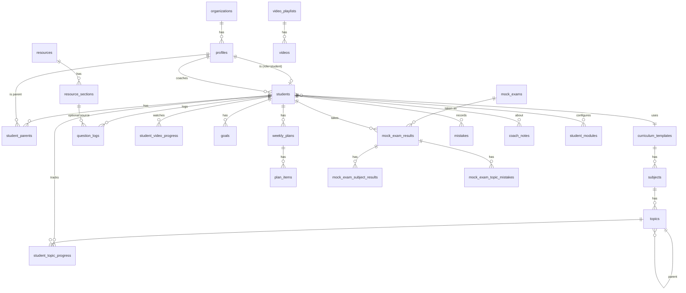

# Veri Modeli

> Bu belge referanstır; gerçek şema `supabase/migrations/` altındaki dosyalardır. Tablolar fazlara göre ayrı migration dosyalarında oluşturulur. Buradaki DDL taslakları kolon adları, tipler ve kısıtlar için bağlayıcıdır; küçük iyileştirmeler yapılabilir ama belge de güncellenmelidir.

## 1. Genel Kurallar

- Tüm tablolar `public` şemasında; yardımcı güvenlik fonksiyonları `private` şemasında.
- Birincil anahtar: `id uuid primary key default gen_random_uuid()` (bağlantı tabloları hariç, onlarda bileşik anahtar).
- Her tabloda `created_at timestamptz not null default now()`; değişebilen tablolarda `updated_at` + `private.set_updated_at()` tetikleyicisi (trigger fonksiyonu `private`'tadır: API'ye açık değildir, hiçbir role execute verilmez; tetiklenirken execute denetlenmez).
- Tablo ve kolon adları İngilizce, `snake_case`, tablo adları çoğul.
- Enum değerleri İngilizce; Türkçe karşılıkları `src/content/labels.ts` içinde.
- Öğrenciye bağlı her tablo `student_id uuid not null references students(profile_id) on delete cascade` içerir → öğrenci silinince tüm verisi gider (KVKK silme hakkı).
- Her yabancı anahtar kolonuna indeks eklenir.
- **Her tabloda RLS açıktır.** RLS'si olmayan tablo migration incelemesinden geçmez.
- Politikalarda `auth.uid()` doğrudan değil `(select auth.uid())` biçiminde yazılır (Postgres sorgu başına bir kez hesaplar, performans için).

## 2. İlişki Diyagramı (özet)



## 3. Enum Tipleri

```sql
create type user_role            as enum ('owner', 'coach', 'student', 'parent');
create type student_status       as enum ('active', 'paused', 'archived');
create type parent_relation      as enum ('mother', 'father', 'guardian', 'other');
create type consent_type         as enum ('privacy_notice', 'explicit_consent', 'photo_upload');
create type topic_status         as enum ('not_started', 'studying', 'completed', 'needs_review', 'mastered');
create type busy_slot_kind       as enum ('school', 'tutoring_center', 'private_lesson', 'course', 'other');   -- Faz 4a
create type resource_type        as enum ('lecture_book', 'question_bank', 'worksheet', 'mock_book', 'booklet', 'other');
create type question_source      as enum ('resource', 'plan', 'school', 'online', 'free');
create type goal_metric          as enum ('questions');           -- Faz 3 sade (02 karar #32); ileride add value
create type goal_period          as enum ('daily', 'weekly');     -- Faz 3 sade; 'monthly', 'custom' gerekince eklenir
create type plan_status          as enum ('draft', 'published');
create type plan_item_kind       as enum ('topic_study', 'questions', 'review', 'link', 'custom');   -- Faz 4b (karar A13); Faz 7: add value 'section', 'video'
create type topic_alert_kind     as enum ('knowledge_gap', 'low_accuracy', 'review_due', 'forgetting_risk', 'stale', 'not_started', 'neglected_subject', 'behind_school');   -- Faz 4c; 4d suggestion_dismissals.kind; Faz 5a add value 'behind_school'
create type mistake_reason       as enum ('knowledge_gap', 'attention', 'time', 'misread_question', 'calculation', 'unknown');
create type mistake_status       as enum ('open', 'reviewing', 'solved');
create type note_visibility      as enum ('coach_only', 'student', 'parent', 'student_and_parent');
create type session_kind         as enum ('pomodoro', 'free', 'video', 'review', 'reading');
```

## 4. Tablolar

### 4.1 Kimlik ve Kurum (Faz 1)

```sql
organizations (
  id uuid pk,
  name text not null,
  slug text unique not null,
  settings jsonb not null default '{}',   -- uyarı eşikleri, tekrar aralıkları, sıralama tablosu açık mı
  created_at, updated_at
)

profiles (
  id uuid pk references auth.users(id) on delete cascade,
  organization_id uuid not null references organizations(id),
  role user_role not null,
  full_name text not null,
  username text unique,                   -- check: ~ '^[a-z0-9._]{3,30}$' ve (role = 'student') = (username is not null)
  avatar_url text,
  phone text,
  last_seen_at timestamptz,
  created_at, updated_at
)

students (
  profile_id uuid pk references profiles(id) on delete cascade,
  organization_id uuid not null references organizations(id),
  coach_id uuid not null references profiles(id),
  curriculum_template_id uuid references curriculum_templates(id),  -- Faz 2: FK; nullable kaldı (karar #28), form zorunlu tutar
  season text not null,                   -- '2026-2027'
  grade smallint not null default 8,
  school_name text,
  class_section text,
  exam_date date,                         -- LGS tarihi (geri sayım)
  target_percentile numeric(5,2),
  status student_status not null default 'active',
  created_at, updated_at
)

student_parents (
  student_id uuid references students(profile_id) on delete cascade,
  parent_id uuid references profiles(id) on delete cascade,
  relation parent_relation not null,
  can_view_details boolean not null default false,  -- yanlış defteri, günlük durum vb.
  created_at,
  primary key (student_id, parent_id)
)

invitations (
  id uuid pk,
  organization_id uuid not null references organizations(id),
  code text unique not null,              -- 8 karakter, alfabe ABCDEFGHJKMNPQRSTUVWXYZ23456789 (I, L, O, 0, 1 yok), lib/invitations/code.ts, 7 gün
  role user_role not null check (role in ('coach', 'parent')),
  student_id uuid references students(profile_id) on delete cascade,  -- check: (role = 'parent') = (student_id is not null)
  created_by uuid not null references profiles(id),
  expires_at timestamptz not null,
  used_by uuid references profiles(id),
  used_at timestamptz,
  created_at
)

consents (
  id uuid pk,
  student_id uuid not null references students(profile_id) on delete cascade,
  given_by uuid references profiles(id),  -- veli; kâğıt onayda null + recorded_by dolu
  recorded_by uuid references profiles(id),  -- check: given_by is not null or recorded_by is not null
  type consent_type not null,
  document_version text not null,         -- 'aydinlatma-v1'
  given_at timestamptz not null default now(),
  revoked_at timestamptz,
  created_at
)

student_modules (
  student_id uuid references students(profile_id) on delete cascade,
  module_id text not null,                -- manifest id
  enabled boolean not null,
  settings jsonb not null default '{}',
  updated_at,
  primary key (student_id, module_id)
)
```

Faz 1a'da uygulanan migration'lar: `faz1a_enums`, `faz1a_core_tables`, `faz1a_private_helpers`, `faz1a_privileges`, `faz1a_rls_policies`. Faz 1b: `faz1b_table_grants`, `faz1b_access_token_hook`, `faz1b_student_rpcs`, `faz1b_assign_coach`, `faz1b_accept_invitation`. Faz 1c şema değiştirmedi. Faz 2: `faz2_topics_schema` (enum, 4 tablo, `private.can_read_template/can_edit_template/subject_template/topic_template`, grant + politikalar), `faz2_topic_rpcs` (`create_student_account` yeni imza: `p_curriculum_template_id`; eski imza `drop function` ile kaldırıldı; `move_topic(p_topic_id, p_direction)` security invoker), `faz2_lgs_2027_template` (sistem şablonu verisi + mevcut öğrencilere atama). Faz 3: `faz3_question_logs_goals` (3 enum, `question_logs`, `goals`, `curriculum_templates.exam_date`, grant + politikalar), `faz3_summary_views` (4 görünüm). Faz 4a: `faz4a_org_settings` (ayar varsayılanları), `faz4a_schedule` (`busy_slot_kind`, `busy_slots`, `schedule_exceptions`, grant + politikalar). Faz 4b: `faz4b_weekly_plans` (2 enum, 2 tablo, `question_logs.plan_item_id`, `private.plan_student/can_read_plan/can_write_plan`, grant + politikalar), `faz4b_plan_rpcs` (`private.can_act_on_plan` + 7 RPC), `faz4b_plan_views` (3 görünüm + `v_coach_student_overview` plan kolonları). Faz 4c: `faz4c_topic_alert_facts` (`topic_alert_kind` enum + `v_topic_alert_facts` görünümü; tablo yok). Faz 4d: `faz4d_suggestion_dismissals` (tablo, grant + politikalar). Faz 4 kapanışı: `faz4e_setup_facts_to_date` (`v_plan_completion` + `to_date_*` kolonları, `v_coach_student_overview` + `plan_to_date_percent_week`, `v_student_setup_facts` görünümü, kurum ayarı `alerts.setup_account_days`). Faz 5a: `faz5a_strategy_settings` (kurum ayarı `strategy`), `faz5a_topic_school_dates` (`topics.school_finish_on`, enum `behind_school`, `set_topic_school_dates` RPC, `v_topic_alert_facts.school_finish_on`).

**Onay tamlığı (Faz 1c, 02 karar #23):** bir öğrencinin onayı, `consents` içinde `privacy_notice` ve `explicit_consent` türlerinin her biri için geri çekilmemiş (`revoked_at is null`) en az bir satır varsa tamdır; satırın veli dijital onayı (`given_by`) ya da koçun işlediği kâğıt onayı (`recorded_by`, `given_by` boş) olması fark etmez. Veli paneli kapısı ve koç ekranındaki rozet bu tanımı kullanır. `student_modules` için satır yoksa manifestteki `defaultEnabled` geçerlidir; seed satır içermez.

Yeni Auth kullanıcısı oluştuğunda `profiles` satırı `auth.users` tetikleyicisiyle değil, açıkça oluşturulur (hata ayıklaması kolay): öğrencide Server Action admin API ile Auth kullanıcısını açar, sonra `create_student_account` RPC'si (sadece `service_role`) profil + öğrenci satırını tek transaction'da yazar; velide e-posta doğrulandıktan sonra `accept_invitation` RPC'si profil + `student_parents` bağlantısını yazar. Öğrenci silme = admin API ile `auth.users` silme; cascade `110_cascade.test.sql` ile doğrulanır.

### 4.2 Müfredat Şablonları (Faz 2)

```sql
curriculum_templates (
  id uuid pk,
  organization_id uuid references organizations(id),  -- null = sistem şablonu
  name text not null,                     -- 'LGS 2027'
  exam_type text not null,                -- 'LGS'
  grade smallint not null,
  season text not null,
  scoring jsonb not null,                 -- {"wrong_penalty": 3, "sections": [...]}
  based_on_id uuid references curriculum_templates(id),
  is_published boolean not null default false,
  exam_date date,                         -- Faz 3: yeni öğrenci formunun sınav tarihi varsayılanı (karar #35)
  created_at, updated_at
)

subjects (
  id uuid pk,
  template_id uuid not null references curriculum_templates(id) on delete cascade,
  code text not null,                     -- 'MAT' — sezonlar arası eşleştirme için
  name text not null,                     -- 'Matematik'
  short_name text not null,               -- 'Mat'
  color text not null,                    -- token öneki: 'subject-math' (04 Bölüm 4.2)
  icon text not null,                     -- lucide ikon adı
  exam_section text,                      -- 'sayisal' | 'sozel'
  exam_question_count smallint,
  sort_order smallint not null,
  unique (template_id, code)
)

topics (
  id uuid pk,
  subject_id uuid not null references subjects(id) on delete cascade,
  parent_id uuid references topics(id) on delete cascade,  -- ünite > konu > alt konu
  name text not null,
  semester smallint check (semester in (1, 2)),
  importance smallint not null default 2 check (importance between 1 and 3),
  estimated_minutes int,
  external_code text,                     -- MEB kazanım kodu (varsa)
  sort_order smallint not null,
  school_finish_on date,                  -- Faz 5a: okulda tahmini bitiş (ünite düzeyinde dolu; karar B1/B17)
  created_at, updated_at
)

student_topic_progress (
  student_id uuid references students(profile_id) on delete cascade,
  topic_id uuid references topics(id) on delete cascade,
  status topic_status not null default 'not_started',
  confidence smallint check (confidence between 1 and 5),
  completed_at timestamptz,
  review_stage smallint not null default 0,
  last_reviewed_at timestamptz,
  next_review_at date,
  updated_at,
  primary key (student_id, topic_id)
)
```

`student_topic_progress` satırları **tembel (lazy)** oluşur: satır yoksa durum `not_started` kabul edilir. Böylece şablona konu eklemek için öğrenci başına satır üretmek gerekmez. Yazma `setTopicProgress` eylemiyle upsert; `completed_at` durum ilk kez `completed`/`mastered` olduğunda atanır, geri alınınca temizlenir. Tamamlanma yüzdesi `(completed + mastered) / toplam` (ünite düzeyi konular; `features/topics/lib/completion.ts`).

**Erişim (Faz 2, karar #28):** `organization_id null` sistem şablonudur; şablon/ders/konu okuma = sistem ya da kendi kurumu (`private.can_read_template`), yazma = koç/owner ve aynı koşul (`private.can_edit_template`). Konu sırası `move_topic` RPC'si ile değişir (kardeşler `(sort_order, created_at, id)` sırasıyla 1..n yeniden numaralanır, sonra komşuyla takas). LGS 2027 şablonu `faz2_lgs_2027_template` migration'ında sabit kimliklerle gelir (karar #27).

**Okul takvimi (Faz 5a, `09-faz5-strateji.md` §1.3):** `topics.school_finish_on` şablon düzeyinde tek takvimdir (aynı şablonu kullanan tüm öğrenciler paylaşır; farklı okullar için yaklaşıklık, `strategy.school_lag_weeks` toleransı bunun içindir; öğrenci bazlı kaydırma Faz 6+). Tarih tutulur, arayüz haftayı gösterir (karar B1); toplu doldurma (`/coach/templates?view=calendar`, "Sıradan dağıt") `lib/strategy/school-calendar.ts: distributeEvenly` ile pazartesi yazar. Yazma `set_topic_school_dates(p_rows jsonb)` RPC'si ile (§7). RLS/grant değişmez; indeks gerekmez.

Konu `completed` işaretlendiğinde `next_review_at = bugün + aralık[0]` atanır (Faz 6, tekrar modülü; Faz 2'de yazılmaz). Tekrar yapıldıkça `review_stage` artar. Aralıklar `organizations.settings.review_intervals` (varsayılan `[1, 3, 7, 15, 30]`).

### 4.3 Soru Takibi ve Hedefler (Faz 3)

```sql
question_logs (
  id uuid pk,
  student_id uuid not null references students(profile_id) on delete cascade,
  log_date date not null default (now() at time zone 'Europe/Istanbul')::date,
  subject_id uuid not null references subjects(id),
  topic_id uuid references topics(id),
  -- section_id uuid references resource_sections(id)                  -- Faz 7'de eklenir (kolon yok)
  plan_item_id uuid references plan_items(id) on delete set null,      -- Faz 4b; dolu kayıtta source = 'plan'
  source question_source not null default 'free',
  total_count int not null check (total_count > 0 and total_count <= 500),
  correct_count int check (correct_count >= 0),
  wrong_count int check (wrong_count >= 0),
  blank_count int check (blank_count >= 0),
  duration_minutes int check (duration_minutes between 1 and 600),
  note text,
  created_at, updated_at,
  check (coalesce(correct_count,0) + coalesce(wrong_count,0) + coalesce(blank_count,0) <= total_count),
  check (log_date <= (now() at time zone 'Europe/Istanbul')::date)   -- gelecek tarih yok
)
-- index (student_id, log_date desc), (student_id, subject_id, log_date), (subject_id), (topic_id)

goals (
  id uuid pk,
  student_id uuid not null references students(profile_id) on delete cascade,
  created_by uuid not null references profiles(id),
  title text,
  metric goal_metric not null default 'questions',
  subject_id uuid references subjects(id),  -- null = tüm dersler (Faz 3'te hep null)
  period goal_period not null,
  target_value numeric not null check (target_value > 0),
  starts_on date not null default (now() at time zone 'Europe/Istanbul')::date,
  ends_on date,                             -- null = süresiz tekrarlayan
  is_active boolean not null default true,
  created_at, updated_at
)
-- unique (student_id, period) where is_active  → dönem başına tek aktif hedef (karar #32)
```

Uygulama `total_count = correct + wrong + blank` yazar (üçü zorunlu); `log_date` istemciden alınmaz, Server Action İstanbul bugününü atar; düzenlemede tarih değişebilir ama gelecek olamaz (zod + check). Hedef ilerlemesi saklanmaz; `v_student_daily_summary`'den uygulamada hesaplanır (`features/goals/server/queries.ts: getGoalProgress`). Seri (ardışık kayıt günü) da aynı görünümden `lib/dates/streak` ile hesaplanır: bugün veya dün biten ardışık gün sayısı.

### 4.4a Haftalık Program ve Kurum Ayarları (Faz 4a) ✅

Tasarım: `08-faz4-plan-sistemi.md` §1.2–1.3. `organizations.settings` varsayılanları migration `faz4a_org_settings` ile yazılır (`private.default_org_settings()`, kolon varsayılanı; anahtarlar `schedule`, `planner`, `alerts`, `suggestions`; `faz4e` `alerts.setup_account_days` = 7 ekledi; Faz 5a `faz5a_strategy_settings` `strategy` anahtarını ekledi: `periods` (sezon dönemleri, 0–6 satır `{name, starts_on, ends_on, mix{new_topic, weak, review}}`, boş liste = dönem karışımı yok; varsayılan dönemler migration'a gömülmez, `lib/strategy/periods.ts: suggestSeasonPeriods(examDate)` ayar formunda önerir, yerel seed demo kuruma dolu yazar — karar B2/B3), `proximity_days` 120, `school_lag_weeks` 2, `topic_minutes_default` 90, `pace_window_days` 28, `topics_finish_weeks_before_exam` 8; `09-faz5-strateji.md` §1.2); uygulama `features/core/lib/org-settings.ts` zod şemasıyla okur (`getOrgSettings()`). Eşikler koda gömülmez.

```sql
busy_slots (
  id uuid pk,
  student_id uuid not null references students(profile_id) on delete cascade,
  day_of_week smallint not null check (day_of_week between 1 and 7),   -- 1 = pazartesi
  starts_at time not null, ends_at time not null,                       -- check (ends_at > starts_at)
  kind busy_slot_kind not null default 'other',
  note text,                                                            -- ≤ 120
  created_by uuid references profiles(id) on delete set null,           -- öğrenci kendi satırını yazabilir
  created_at, updated_at
)
-- index (student_id, day_of_week), (created_by)

schedule_exceptions (
  id uuid pk,
  student_id uuid not null references students(profile_id) on delete cascade,
  on_date date not null,
  starts_at time, ends_at time,             -- ikisi boş = tüm gün; check: birlikte boş ya da dolu ve ends > starts
  title text not null,                      -- 1–80
  note text,
  created_by uuid references profiles(id) on delete set null,
  created_at, updated_at
)
-- index (student_id, on_date), (created_by)
```

Müsait süre veritabanında değil uygulamada hesaplanır (`features/schedule/lib/availability.ts`, saf ve birim testli): kurum uyanık aralığı eksi meşguliyetler (çakışanlar birleştirilir, aralığa kırpılır); tüm gün istisna → 0.

### 4.4 Haftalık Plan (Faz 4b) ✅

Tasarım ve kararlar: `08-faz4-plan-sistemi.md` §1.4. `plan_templates` ve `meetings` bu fazda yapılmadı; `coach_notes` ve `announcements` ayrı planlanır (eski taslakları §4.4c'de).

```sql
weekly_plans (
  id uuid pk,
  student_id uuid not null references students(profile_id) on delete cascade,
  week_start date not null check (extract(isodow from week_start) = 1),  -- pazartesi
  created_by uuid references profiles(id) on delete set null,
  status plan_status not null default 'draft',
  coach_message text,                     -- ≤ 500
  student_reflection text,                -- ≤ 1000, "Haftam nasıl geçti?"
  published_at timestamptz,
  created_at, updated_at,
  unique (student_id, week_start)
)

plan_items (
  id uuid pk,
  plan_id uuid not null references weekly_plans(id) on delete cascade,
  day_of_week smallint check (day_of_week between 1 and 7),   -- NULL = "bu hafta içinde"
  sort_order smallint not null default 0,
  kind plan_item_kind not null,           -- topic_study | questions | review | link | custom (Faz 7: section, video)
  title text not null,                    -- 1–120; boşsa uygulama `taskTitle` ile üretir
  subject_id uuid references subjects(id) on delete set null,
  topic_id uuid references topics(id) on delete set null,
  url text,                               -- check (kind <> 'link' or url ~ '^https?://')
  target_value int check (target_value > 0),
  target_unit text check (target_unit in ('questions', 'minutes')),
  estimated_minutes int not null check (estimated_minutes between 1 and 600),
  completed_at timestamptz,
  student_note text,                      -- ≤ 200
  postponed_from smallint, postponed_at timestamptz,   -- dolu = bir kez ertelendi
  created_at, updated_at
)
-- index (plan_id, day_of_week, sort_order), (subject_id), (topic_id)

question_logs.plan_item_id uuid references plan_items(id) on delete set null   -- + indeks; source = 'plan'
```

`private.plan_student`, `private.can_read_plan` (öğrenci/veli yalnızca `published`; koç her durumda), `private.can_write_plan`, `private.can_act_on_plan` (öğrenci kendi yayınlanmış planı ya da koç). Öğrenci `plan_items`/`weekly_plans` üzerinde doğrudan UPDATE politikasına sahip değildir; tamamlama, geri alma, erteleme, not ve değerlendirme RPC ile (§7). Plan uyumu `v_plan_completion` (§6); erteleme yüzdeyi etkilemez.

### 4.4b Konu Uyarı Olguları (Faz 4c) ✅

Tasarım: `08-faz4-plan-sistemi.md` §1.5, karar A2. Tablo yok; `v_topic_alert_facts` görünümü (§6) öğrenci × ünite düzeyi konu başına **olguları** verir, karar vermez. Kurallar `features/analytics/lib/alerts.ts` (saf, birim testli), eşikler `organizations.settings.alerts`'ten parametre (Faz 5a: + `strategy.school_lag_weeks`, `alertThresholds(settings)`); `alerts.lookback_days` görünümün soru penceresidir. Faz 5a `behind_school` kuralı: `school_finish_on` dolu, konu bitmemiş (`studying` dahil, karar B8) ve `schoolLagWeeks(school_finish_on, bugün) >= school_lag_weeks`; sıra `knowledge_gap → low_accuracy → behind_school → stale → …`; K1 dikkat listesi ve K2 "Okulun gerisinde" listesinde görünür, öğrenci Bugün kartında gösterilmez. 08'deki kolon listesine ek `student_first_log_date` (derste hiç kayıt yoksa ihmal süresi öğrencinin ilk kaydından sayılır). Analiz modülü kapatılan öğrenciler (`student_modules`) sorgu katmanında dışarıda bırakılır. Kurum ayarı formu `/coach/settings` (owner; `organizations` UPDATE politikası).

### 4.4d Öneri Reddetme Hafızası (Faz 4d) ✅

Tasarım: `08-faz4-plan-sistemi.md` §1.6. Koç bir öneriye "Şimdi değil" dediğinde satır açılır; öneri motoru (`features/analytics/lib/suggestions.ts`, saf) `dismissed_until >= bugün` satırları eler, sorgu katmanı da süresi geçenleri getirmez. Satır temizlenmez, upsert ile yenilenir.

```sql
suggestion_dismissals (
  id uuid pk,
  student_id uuid not null references students(profile_id) on delete cascade,
  dismissed_by uuid not null references profiles(id) on delete cascade,   -- koçun hafızası; koç silinince gider
  subject_id uuid not null references subjects(id) on delete cascade,
  topic_id uuid references topics(id) on delete cascade,                   -- ders düzeyi öneride null
  kind topic_alert_kind not null,
  dismissed_until date not null,             -- bugün + suggestions.dismiss_days (Server Action hesaplar)
  created_at,
  unique nulls not distinct (student_id, subject_id, topic_id, kind)
)
-- index (dismissed_by), (subject_id), (topic_id); (student_id, …) tekil kısıt indeksinde
```

RLS: koç S I U D (`is_coach_of`; insert/update `dismissed_by` kendisi), owner tümü (`is_coach_of` owner'ı kapsar), öğrenci ve veli hiçbir şey. Tablo yetkisi `authenticated` S I U D. 08'den fark: `dismissed_by` `on delete cascade` (08'de belirtilmemişti; `not null` FK profil silmeyi engellemesin).

### 4.4c Notlar, Duyurular (taslak; ayrı planlanacak)

```sql
coach_notes (
  id uuid pk,
  student_id uuid not null references students(profile_id) on delete cascade,
  author_id uuid not null references profiles(id),
  body text not null,
  visibility note_visibility not null default 'coach_only',
  is_pinned boolean not null default false,
  created_at, updated_at
)

announcements (
  id uuid pk,
  organization_id uuid not null references organizations(id),
  author_id uuid not null references profiles(id),
  title text not null,
  body text not null,
  audience jsonb not null,                -- {"roles": ["student"], "student_ids": null}
  published_at timestamptz,
  created_at
)
```

### 4.5 Kaynaklar ve Videolar (Faz 7)

```sql
resources (
  id uuid pk,
  organization_id uuid not null references organizations(id),
  template_id uuid not null references curriculum_templates(id),
  subject_id uuid references subjects(id),     -- null = çok dersli kitap
  type resource_type not null,
  title text not null,
  publisher text,
  publish_year smallint,
  cover_path text,                             -- storage
  created_at, updated_at
)

resource_sections (
  id uuid pk,
  resource_id uuid not null references resources(id) on delete cascade,
  subject_id uuid references subjects(id),
  topic_id uuid references topics(id),
  title text not null,                         -- 'Test 12'
  question_count smallint,
  page_start smallint, page_end smallint,
  sort_order smallint not null
)

student_resources (
  student_id uuid references students(profile_id) on delete cascade,
  resource_id uuid references resources(id) on delete cascade,
  assigned_by uuid references profiles(id),
  status text not null default 'active' check (status in ('active','completed','dropped')),
  assigned_at timestamptz not null default now(),
  primary key (student_id, resource_id)
)

video_playlists (
  id uuid pk,
  organization_id uuid not null references organizations(id),
  template_id uuid not null references curriculum_templates(id),
  subject_id uuid references subjects(id),
  title text not null,
  channel_name text,
  youtube_playlist_id text,
  imported_at timestamptz,
  sort_order smallint,
  created_at, updated_at
)

videos (
  id uuid pk,
  playlist_id uuid not null references video_playlists(id) on delete cascade,
  topic_id uuid references topics(id),
  youtube_video_id text not null,
  title text not null,
  duration_seconds int,
  sort_order smallint not null,
  unique (playlist_id, youtube_video_id)
)

student_playlists (
  student_id uuid references students(profile_id) on delete cascade,
  playlist_id uuid references video_playlists(id) on delete cascade,
  assigned_by uuid references profiles(id),
  assigned_at timestamptz not null default now(),
  primary key (student_id, playlist_id)
)

student_video_progress (
  student_id uuid references students(profile_id) on delete cascade,
  video_id uuid references videos(id) on delete cascade,
  watched_seconds int not null default 0,
  completed_at timestamptz,
  note text,
  updated_at,
  primary key (student_id, video_id)
)
```

**Tek veri kaynağı kuralı:** Bir testin "bitti" sayılması ayrı bir tabloda tutulmaz. `question_logs.section_id` dolu bir kaydın varlığı o testin bittiği anlamına gelir. Kaynak ilerleme yüzdesi `v_student_resource_progress` görünümüyle hesaplanır.

**YouTube içe aktarma:** Sunucu tarafında YouTube Data API v3 `playlistItems.list` (sayfalı) + `videos.list` (süreler için) çağrılır. API anahtarı istemciye gitmez. Video oynatma `youtube-nocookie.com` embed'i ile yapılır; %90 izlenince `completed_at` otomatik atanabilir (IFrame Player API), öğrenci elle de işaretleyebilir.

### 4.6 Denemeler, Yanlış Defteri (Faz 6)

```sql
mock_exams (
  id uuid pk,
  organization_id uuid not null references organizations(id),
  template_id uuid not null references curriculum_templates(id),
  title text not null,                    -- 'X Yayınları Türkiye Geneli 3'
  publisher text,
  exam_date date,
  is_full_exam boolean not null default true,   -- false = branş denemesi
  created_by uuid references profiles(id),
  created_at, updated_at
)

mock_exam_results (
  id uuid pk,
  student_id uuid not null references students(profile_id) on delete cascade,
  mock_exam_id uuid references mock_exams(id) on delete set null,  -- katalog dışı deneme: null
  custom_title text,
  taken_on date not null,
  duration_minutes int,
  score numeric(6,3),                     -- yayınevinin verdiği puan (isteğe bağlı, elle)
  percentile numeric(5,2),                -- yayınevinin verdiği yüzdelik (isteğe bağlı)
  note text,
  created_at, updated_at,
  check (mock_exam_id is not null or custom_title is not null)
)

mock_exam_subject_results (
  result_id uuid references mock_exam_results(id) on delete cascade,
  subject_id uuid references subjects(id),
  correct_count smallint not null default 0,
  wrong_count smallint not null default 0,
  blank_count smallint not null default 0,
  wrong_penalty smallint not null,        -- kayıt anında şablondan kopyalanır (0 = ceza yok)
  net numeric(5,2) generated always as (
    correct_count - coalesce(wrong_count::numeric / nullif(wrong_penalty, 0), 0)
  ) stored,
  primary key (result_id, subject_id)
)

mock_exam_topic_mistakes (
  result_id uuid references mock_exam_results(id) on delete cascade,
  topic_id uuid references topics(id),
  wrong_count smallint not null default 0,
  blank_count smallint not null default 0,
  primary key (result_id, topic_id)
)

mistakes (
  id uuid pk,
  student_id uuid not null references students(profile_id) on delete cascade,
  subject_id uuid not null references subjects(id),
  topic_id uuid references topics(id),
  mock_result_id uuid references mock_exam_results(id) on delete set null,
  section_id uuid references resource_sections(id) on delete set null,
  question_image_path text,
  solution_image_path text,
  reason mistake_reason not null default 'unknown',
  note text,
  status mistake_status not null default 'open',
  review_stage smallint not null default 0,
  last_reviewed_at timestamptz,
  next_review_at date,
  created_at, updated_at
)
```

LGS puanı standart sapmaya dayalı olarak ÖSYM/MEB tarafından hesaplandığı için uygulama **puan hesaplamaz**; sadece net hesaplar. Yayınevinin verdiği puan ve yüzdelik isteğe bağlı olarak elle girilir.

Deneme sonucu kaydı (sonuç + ders sonuçları + konu yanlışları) `public.save_mock_exam_result(payload jsonb)` fonksiyonuyla tek transaction'da yapılır.

### 4.7 Bildirimler (Faz 8)

```sql
notifications (
  id uuid pk,
  recipient_id uuid not null references profiles(id) on delete cascade,
  student_id uuid references students(profile_id) on delete cascade,
  type text not null,                     -- 'plan_published' | 'note_added' | 'review_due' | 'alert_inactive' | 'weekly_summary'
  title text not null,
  body text,
  link text,
  data jsonb not null default '{}',
  read_at timestamptz,
  created_at
)
-- index (recipient_id, read_at, created_at desc)

push_subscriptions (                      -- Faz 9
  id uuid pk,
  profile_id uuid not null references profiles(id) on delete cascade,
  endpoint text unique not null,
  keys jsonb not null,
  created_at
)
```

### 4.8 Zenginleştirme Modülleri (Faz 9)

```sql
study_sessions (
  id uuid pk, student_id … cascade,
  started_at timestamptz not null, ended_at timestamptz,
  duration_minutes int not null,
  kind session_kind not null,
  subject_id uuid references subjects(id), topic_id uuid references topics(id),
  focus_rating smallint check (focus_rating between 1 and 5),
  note text, created_at
)

daily_checkins (
  student_id … cascade, checkin_date date not null,
  mood smallint check (mood between 1 and 5),
  energy smallint check (energy between 1 and 5),
  sleep_hours numeric(3,1) check (sleep_hours between 0 and 16),
  note text, created_at, updated_at,
  primary key (student_id, checkin_date)
)

reading_logs (
  id uuid pk, student_id … cascade,
  log_date date not null, book_title text not null,
  pages smallint not null check (pages > 0), minutes smallint,
  created_at
)

schools (
  id uuid pk, organization_id uuid not null references organizations(id),
  name text not null, city text, district text, school_type text,
  reference_year smallint, base_percentile numeric(5,2), base_score numeric(6,3),
  created_at, updated_at
)

student_target_schools (
  student_id … cascade, school_id uuid references schools(id) on delete cascade,
  priority smallint not null,
  primary key (student_id, school_id)
)

achievements (
  id uuid pk, code text unique not null, name text not null,
  description text not null, icon text not null,
  rule jsonb not null                     -- {"metric":"questions_total","gte":1000}
)

student_achievements (
  student_id … cascade, achievement_id uuid references achievements(id),
  earned_at timestamptz not null default now(),
  primary key (student_id, achievement_id)
)

school_exam_grades (
  id uuid pk, student_id … cascade,
  subject_id uuid references subjects(id), term smallint, exam_no smallint,
  grade numeric(5,2) check (grade between 0 and 100),
  exam_date date, created_at
)
```

## 5. Güvenlik: RLS

### 5.1 Yardımcı fonksiyonlar

```sql
create schema if not exists private;
grant usage on schema private to authenticated;

-- Oturumdaki kullanıcının profili
create or replace function private.my_role()
returns public.user_role
language sql stable security definer set search_path = ''
as $$ select role from public.profiles where id = (select auth.uid()) $$;

create or replace function private.my_org()
returns uuid
language sql stable security definer set search_path = ''
as $$ select organization_id from public.profiles where id = (select auth.uid()) $$;

-- Koç mu (veya aynı kurumun sahibi mi)?
create or replace function private.is_coach_of(p_student_id uuid)
returns boolean
language sql stable security definer set search_path = ''
as $$
  select exists (
    select 1
    from public.students s
    join public.profiles me on me.id = (select auth.uid())
    where s.profile_id = p_student_id
      and s.organization_id = me.organization_id
      and (s.coach_id = me.id or me.role = 'owner')
  )
$$;

create or replace function private.is_parent_of(p_student_id uuid, p_details boolean default false)
returns boolean
language sql stable security definer set search_path = ''
as $$
  select exists (
    select 1 from public.student_parents sp
    where sp.student_id = p_student_id
      and sp.parent_id = (select auth.uid())
      and (not p_details or sp.can_view_details)
  )
$$;

create or replace function private.can_read_student(p_student_id uuid)
returns boolean
language sql stable security definer set search_path = ''
as $$
  select p_student_id = (select auth.uid())
      or private.is_coach_of(p_student_id)
      or private.is_parent_of(p_student_id)
$$;

create or replace function private.can_write_student(p_student_id uuid)
returns boolean
language sql stable security definer set search_path = ''
as $$
  select p_student_id = (select auth.uid())
      or private.is_coach_of(p_student_id)
$$;

-- Profil görünürlüğü: kendisi; owner kendi kurumundaki herkes; koç kendi
-- öğrencileri ve onların velileri; öğrenci kendi koçu ve kendi velileri;
-- veli kendi çocuğu ve çocuğun koçu.
create or replace function private.can_see_profile(p_target uuid)
returns boolean
language sql stable security definer set search_path = ''
as $$ ... $$;  -- tam gövde: supabase/migrations/*_faz1a_private_helpers.sql

-- Hedef, oturum sahibinin kurumunda role = 'parent' bir profil mi?
-- student_parents INSERT/UPDATE with check'inde kullanılır.
create or replace function private.is_parent_profile_in_my_org(p_profile uuid)
returns boolean
language sql stable security definer set search_path = ''
as $$ ... $$;
```

**Yetki sertleştirme** (`faz1a_privileges`; RLS asıl güvenlik, bunlar ikinci katman):

- `revoke all on schema private from public, anon; grant usage on schema private to authenticated;`
- Postgres yeni fonksiyonlara yerleşik olarak PUBLIC execute verir. Bu yerleşik varsayılan şema düzeyindeki `alter default privileges ... in schema` ile **kaldırılamaz** (şema girdileri globale eklenir); bu yüzden global ifade kullanılır: `alter default privileges for role postgres revoke execute on functions from public;`. `private` fonksiyonlarına execute **fonksiyon başına** `authenticated`'a verilir (`grant execute on all functions` değil; cron fonksiyonları kapalı kalır). `set_updated_at`'a hiçbir role execute verilmez.
- `anon`'un `public` tablolarında hiçbir yetkisi yok: mevcut tablolarda `revoke all ... from anon`; gelecektekiler için `alter default privileges for role postgres in schema public revoke all on tables from anon; ... revoke all on sequences from anon; ... revoke execute on functions from anon, authenticated;`. Yeni `public` fonksiyonlarında `authenticated` execute'u fonksiyon başına açıkça verilir.
- **Tablo yetkileri açıkça verilir** (`faz1b_table_grants`): Supabase'in yerleşik `grant all … to authenticated` davranışına güvenilmez; `authenticated` ve `service_role`'den tüm tablo yetkileri geri alınıp politikalarla birebir örtüşen yetkiler tablo başına verilir (`service_role` tam yetkili). `alter default privileges … revoke all on tables from authenticated` ile yeni tablolar `authenticated` için **kapalı doğar**; her yeni tablonun migration'ı kendi GRANT'larını yazar ve `090_schema_guards` içindeki beklenen yetki matrisine satır ekler (matriste olmayan tablo testi düşürür).
- **Eklenti notu:** `alter default privileges for role postgres revoke execute on functions from public` global olduğu için ileride `postgres` rolüyle kurulacak eklentilerin (pg_net, pg_cron, pgsodium vb.) fonksiyonları da PUBLIC execute'suz doğar. Bir eklenti fonksiyonu `authenticated` ya da `service_role`'den çağrılacaksa execute yetkisi o migration'da açıkça verilir.
- Kolon düzeyi UPDATE (bkz. 5.3 seçenek (c)): `profiles` → sadece `full_name, avatar_url, phone`; `students` → `curriculum_template_id, season, grade, school_name, class_section, exam_date, target_percentile, status` (`profile_id`, `organization_id`, `coach_id` API'den değişmez; koç ataması Faz 1b'de owner kontrollü RPC ile).
- Bu kurallar `supabase/tests/090_schema_guards.test.sql` ile katalog üzerinden her tablo/fonksiyon için otomatik doğrulanır.

### 5.2 Standart politika kalıbı (öğrenci verisi)

```sql
alter table public.question_logs enable row level security;

create policy question_logs_select on public.question_logs
  for select to authenticated
  using (private.can_read_student(student_id));

create policy question_logs_insert on public.question_logs
  for insert to authenticated
  with check (private.can_write_student(student_id));

create policy question_logs_update on public.question_logs
  for update to authenticated
  using (private.can_write_student(student_id))
  with check (private.can_write_student(student_id));

create policy question_logs_delete on public.question_logs
  for delete to authenticated
  using (private.can_write_student(student_id));
```

### 5.3 RLS matrisi

S: select, I: insert, U: update, D: delete. "Kendi" = kendi öğrenci satırı.

| Tablo | Öğrenci | Koç (kendi öğrencileri) | Veli | Owner (kurum) |
|---|---|---|---|---|
| organizations | S (kendi) | S | S | S U |
| profiles | S U (kendi; kolon: full_name, avatar_url, phone) + S (koçu, velileri) | S (kendi + öğrencileri + velileri) | S (kendi + çocuk + çocuğun koçu) | S U (kurum, aynı kolon kısıtı); I yok → secret key |
| students | S (kendi) | S U (sınırlı kolon; kurum dışına taşınamaz) | S (çocuk) | S U; I/D yok → secret key + yetki kontrolü (Faz 1b) |
| student_parents | S (kendi) | S I U D (parent_id aynı kurumda role=parent olmalı) | S (kendi bağlantısı) | Tümü |
| invitations | – | S I D (kendi oluşturdukları; veli daveti sadece kendi öğrencisi için; koç daveti oluşturamaz) | – | Tümü (koç daveti sadece owner) |
| consents | S | S I (recorded_by = kendisi) | S I (kendi çocuğu; given_by = kendisi, recorded_by boş) | S I (recorded_by = kendisi; is_coach_of owner'ı kapsar). U/D yok |
| student_modules | S | S I U D | S | Tümü |
| curriculum_templates, subjects, topics | S (sistem + kurum) | S I U D (sistem + kurum; karar #28) | S (sistem + kurum) | S I U D (sistem + kurum) |
| student_topic_progress | S I U | S I U | S | S I U (D yok; konu silinince cascade) |
| question_logs | S I U D | S I U D | S | Tümü |
| goals | S | S I U D (`is_coach_of`; `created_by` kendisi) | S | S I U D |
| busy_slots, schedule_exceptions (Faz 4a) | S I U D (kendi; insert `created_by` kendisi) | S I U D | S | Tümü |
| weekly_plans | S (sadece published); reflection RPC ile | S I U D (`is_coach_of`; `created_by` kendisi) | S (published) | Tümü |
| plan_items | S (`can_read_plan`); tamamlama/not/erteleme RPC ile | S I U D (`can_write_plan`) | S (`can_read_plan`) | Tümü |
| suggestion_dismissals (Faz 4d) | – | S I U D (`is_coach_of`; `dismissed_by` kendisi) | – | Tümü |
| coach_notes | S (visibility ∈ student, student_and_parent) | S I U D | S (visibility ∈ parent, student_and_parent) | Tümü |
| announcements | S (hedef kitlede ise) | S I (kendi) | S (hedef kitlede ise) | Tümü |
| resources, resource_sections, video_playlists, videos, mock_exams, schools | S (kurum) | S I U | – | Tümü |
| student_resources, student_playlists | S | S I U D | S | Tümü |
| student_video_progress | S I U | S | S | Tümü |
| mock_exam_results (+ alt tablolar) | S I U D | S I U D | S | Tümü |
| mistakes | S I U D | S U | S (can_view_details) | Tümü |
| notifications | S U (kendi) | S U (kendi) | S U (kendi) | S U (kendi) |
| study_sessions, reading_logs, school_exam_grades | S I U D | S | S | Tümü |
| daily_checkins | S I U | S | S (can_view_details) | Tümü |

Kolon düzeyinde kısıt gereken yerlerde (öğrencinin `plan_items` üzerinde sadece `completed_at` ve `student_note` güncelleyebilmesi gibi) iki yol vardır: (a) `update` yetkisini tabloya değil fonksiyona vermek (`public.complete_plan_item(item_id, note)` security definer), (b) tetikleyiciyle diğer kolonların değişmediğini doğrulamak. Üçüncü yol (c) **kolon düzeyi GRANT** (`revoke update on table … from authenticated; grant update (kolonlar) … to authenticated`): kısıt satır politikasından bağımsız ve rol bazlıdır, güncellemeye çalışan 42501 alır. **Tercih:** kolon kümesi sabit ve rolden bağımsızsa (c) — `profiles`, `students` böyle yapıldı; koşula bağlı kısıtlarda (a) fonksiyon, çünkü niyeti açık.

### 5.4 RLS test kalıbı (pgTAP)

Her tablo için en az şu testler yazılır:

1. Öğrenci A kendi satırını görür.
2. Öğrenci A, öğrenci B'nin satırını **göremez** ve ekleyemez.
3. Koç X kendi öğrencisinin satırını görür, başka koçun öğrencisini göremez.
4. Veli sadece kendi çocuğunun satırını görür; `can_view_details=false` ise detay tablolarını göremez.
5. Oturumsuz (`anon`) kullanıcı hiçbir şey göremez (tablo yetkisi olmadığı için `42501`).

Ek testler (Faz 1a): öğrenci `profiles.role/username/organization_id` kolonlarını güncelleyemez (owner da); öğrenci `students` satırını güncelleyemez; koç `students.organization_id/coach_id/profile_id` değiştiremez; başka kurumun koçu öğrenciyi hiç göremez; `anon` `private` fonksiyonlarını çağıramaz; veli `can_view_details=false` iken `is_parent_of(…, true)` false; `can_see_profile` sınırları. `090_schema_guards.test.sql` katalogdan döngüyle her `public` tablosunda RLS'nin açık ve `anon` yetkisinin sıfır olduğunu, `authenticated`'ın tam olarak beklenen yetkilere (matris; kolon düzeyi dahil) ve `service_role`'ün tam yetkiye sahip olduğunu, `public`/`private` fonksiyonlarında `anon`/PUBLIC execute olmadığını doğrular (yeni tablolar otomatik kapsanır; matriste tanımsız tablo testi düşürür).

Test altyapısı: `supabase/tests/000_test_helpers.sql` `tests` şemasını **commit eder** (transaction yok); sabit kimlikli fixture (`tests.id('student_a')`, `tests.seed_fixture()`: 2 kurum, koçlar X/Y/Z, öğrenciler A/B/C/Z, veliler P1/P2/P3/PZ), `tests.create_auth_user(name)` (profilsiz Auth kullanıcısı), `tests.authenticate_as(name)`, `tests.authenticate_as_anon()`, `tests.authenticate_as_service_role()`, `tests.clear_authentication()`, `tests.row_count(sql)`. Faz 1b dosyaları: `095_access_token_hook`, `100_student_rpcs`, `105_assign_coach`, `110_cascade`, `120_accept_invitation`. Faz 2: `130_curriculum` (şablon/ders/konu RLS + `move_topic`), `140_topic_progress`; fixture'a `tests.seed_templates()` (tpl_system, tpl_org_a, tpl_org_b) eklendi; `100` tek imza kontrolü yapar. Faz 3: `150_question_logs` (5 senaryo + İstanbul günü: oturum `UTC` iken `log_date` varsayılanı ve görünümler İstanbul'a göre; gelecek tarih 23514; görünümler security_invoker ve anon'a kapalı), `160_goals` (öğrenci/veli yazamaz, dönem başına tek aktif hedef 23505, owner yazar). Faz 4a: `170_schedule` (iki tablo 5 senaryo, saat kısıtları, `created_by` oturum sahibi, ayar varsayılanları); `110_cascade` program satırlarını kapsar. Faz 4b: `180_weekly_plans` (öğrenci taslağı göremez/yayınlananı görür, doğrudan UPDATE 0 satır, link URL ve pazartesi kısıtları, `plan_item_id` bağı, görünümler), `185_plan_rpcs` (complete log'lu/log'suz/idempotent, uncomplete bağ koparma, postpone kuralları, note, reflection `week_closed`, move sıralama ve yetki, copy yetki/only_incomplete/ekleme). Faz 4c: `190_topic_alert_facts` (görünüm RLS: koç kendi öğrencisi, owner kurumu, öğrenci kendisi, veli çocuğu, anon 42501; satır yoksa `not_started`; soru penceresi kurum ayarından; son kayıt tarihleri; `is_next_topic` ilerlemeyle kayar). Faz 4 kapanışı: `180` sonuna bugüne kadar uyumu (pazartesi görevi sayılır, tamamlanmamış gün atanmamış sayılmaz, tamamlanmış sayılır, geçmiş hafta = hafta geneli, gelecek hafta null), `197_student_setup_facts` (koç kendi öğrencileri, bayraklar olguyla döner, taslak plan yayınlanmış sayılmaz, anon 42501). Faz 4d: `195_suggestion_dismissals` (koç S I U D kendi öğrencisi, `dismissed_by` oturum sahibi, başka koç 0 satır, owner kurum / başka kurum 0, öğrenci ve veli 0 satır + 42501, anon 42501; `unique nulls not distinct` 23505 ve upsert yenileme); `110_cascade` reddetme satırını kapsar. Faz 5a: `200_strategy_settings` (`strategy` varsayılanları, `periods` boş, `defaults || settings` ile mevcut değer kazanır, owner dönem yazar/koç okur), `205_topic_school_dates` (koç sistem şablonunda `school_finish_on` yazar ve RPC ile toplu yazar/temizler, atomiklik: başka kurumun konusu payload'da → 42501 ve hiçbir satır yazılmaz, dizi olmayan payload 22023, görünümde `school_finish_on` dolu, öğrenci/veli/başka kurum koçu RPC 42501 ve doğrudan 0 satır, anon 42501). `090` ayrıca her `public` görünümünde `security_invoker` açık, anon yetkisiz ve `authenticated` yalnızca select olduğunu denetler. Diğer dosyalar `begin … rollback`. Fixture fonksiyonlarına `anon`/`authenticated` execute verilmez. Sadece yerel ve CI; uzak projede `supabase test db --linked` çalıştırılmaz.

## 6. Görünümler (Views)

Tüm görünümler `with (security_invoker = true)` ile oluşturulur, böylece alttaki tabloların RLS'si uygulanır.

"Bugün" ve "bu hafta" görünümlerde `(now() at time zone 'Europe/Istanbul')::date` ve `date_trunc('week', …)` (ISO, pazartesi) ile hesaplanır; `current_date` kullanılmaz. Görünümler `authenticated`'a yalnızca `select` ile verilir; modüller arası veri ihtiyacı (konu istatistiği, koç listesi) bunlarla karşılanır. ✅ = Faz 3'te var.

| Görünüm | Kolonlar (özet) | Kullanım |
|---|---|---|
| `v_student_daily_summary` ✅ | student_id, day, questions, correct, wrong, blank, study_minutes (videos_completed, reading_pages ilgili fazlarda) | Bugün ekranı, hedef ilerlemesi, seri, koç son 14 gün |
| `v_student_subject_weekly` ✅ | student_id, week_start, subject_id, questions, correct, wrong | Haftalık ders dağılımı |
| `v_topic_question_stats` ✅ | student_id, topic_id, questions, correct | Konu detayı (soru sayısı, başarı) |
| `v_topic_mastery` | student_id, topic_id, subject_id, status, confidence, questions, accuracy, mock_wrong_total, mistakes_open, mastery_score | **Konu haritası** |
| `v_student_resource_progress` | student_id, resource_id, sections_total, sections_done, questions_done, percent | Kaynak ilerlemesi |
| `v_student_playlist_progress` | student_id, playlist_id, videos_total, videos_done, percent | Video ilerlemesi |
| `v_mock_exam_trend` | student_id, result_id, taken_on, total_net, subject nets (jsonb) | Net grafiği |
| `v_review_queue` | student_id, item_type ('topic'/'mistake'), item_id, due_on, overdue_days | Tekrar listesi |
| `v_plan_completion` ✅ | student_id, plan_id, week_start, status, items_total, items_completed, postponed_count, percent (öğe yoksa null), to_date_total, to_date_completed, to_date_percent ("bugüne kadar": İstanbul gününe göre bugün ve öncesindeki günlerin görevleri + tamamlanmış gün atanmamış görevler; geçmiş haftada hafta geneliyle eşit, gelecek haftada yalnızca tamamlanmış gün atanmamışlar) | Plan uyumu (K1 sütunu bugüne kadar öne / hafta geneli ikincil, K2 kutusu ikisi de, koç Planlar listesi) |
| `v_student_setup_facts` ✅ | student_id, organization_id, coach_id, status, created_at, has_schedule (busy_slots ya da schedule_exceptions var), has_active_goal, has_published_plan_week (İstanbul haftası), question_log_count | Kurulum uyarıları (yalnızca koç; karar `features/analytics/lib/alerts.ts: evaluateSetupAlerts`, eşik `alerts.setup_account_days`) |
| `v_student_subject_pace` ✅ | student_id, subject_id, questions, minutes, minutes_per_question (son `alerts.lookback_days`, süresi girilmiş kayıtlar) | Görev formunda tahmini süre önerisi |
| `v_week_plan_topics` ✅ | student_id, week_start, subject_id, topic_id | Öneri motoru "bu hafta zaten planlı" (Faz 4d) |
| `v_topic_alert_facts` ✅ | student_id, organization_id, coach_id, subject_* (id, name, short_name, color, sort_order, exam_question_count), topic_* (id, name, sort_order), status (satır yoksa `not_started`), status_changed_at, completed_at, last_reviewed_at, questions_window, correct_window (son `alerts.lookback_days`), last_topic_log_date, subject_last_log_date, student_first_log_date, is_next_topic, school_finish_on (Faz 5a, sona eklendi; Parça 2 `target_on` ekler) | Konu uyarıları (Faz 4c; karar TS'te), görev havuzu kategorileri, öğrenci Bugün kartı |
| `v_coach_student_overview` ✅ | student_id, coach_id, organization_id, full_name, username, status, season, last_log_date, week_questions, weekly_target, week_goal_percent, plan_percent_week, plan_items_week, plan_done_week, plan_percent_last_week, plan_to_date_percent_week (last_net, net_delta, overdue_reviews, alerts ilgili fazlarda eklenir) | **Koç ana ekranı** (tek sorgu) |

`mastery_score` (0-100) başlangıç formülü, kurum ayarlarından ağırlıklandırılabilir:

```
mastery_score = 0.4 * durum_puanı          (not_started 0, studying 30, completed 60, needs_review 40, mastered 100)
              + 0.4 * soru_başarı_yüzdesi  (son 60 gün, en az 20 soru yoksa durum_puanı kullanılır)
              + 0.2 * (100 - deneme_yanlış_cezası)
```

## 7. Fonksiyonlar (RPC)

| Fonksiyon | Tür | Ne yapar |
|---|---|---|
| ~~`private.goal_progress`~~, ~~`public.student_streak`~~ | — | Faz 3'te veritabanı fonksiyonu yerine uygulamada (`getGoalProgress`, `lib/dates/streak`) hesaplanır (karar #36) |
| `public.save_mock_exam_result(payload jsonb)` | security invoker | Sonuç + ders + konu yanlışlarını tek transaction'da yazar |
| `public.complete_plan_item(p_item_id, p_note, p_log jsonb)` ✅ | security definer (`can_act_on_plan`) | Görevi tamamlar; `p_log` doluysa `question_logs` kaydını `plan_item_id` + `source='plan'` ile aynı transaction'da açar; idempotent |
| `public.uncomplete_plan_item(p_item_id)` ✅ | security definer | Tamamlamayı geri alır; bağlı kayıtların `plan_item_id`'sini boşaltır (kayıt silinmez), sayısını döner |
| `public.postpone_plan_item(p_item_id)` ✅ | security definer | Bir kez; hedef `greatest(gün+1, bugün)` (bu haftaysa), 7'yi aşarsa null; gün yoksa/tamamlanmışsa `cannot_postpone` |
| `public.set_plan_item_note(p_item_id, p_note)`, `public.set_plan_reflection(p_plan_id, p_text)` ✅ | security definer | Öğrenci notu (≤ 200); değerlendirme, hafta kapanınca `week_closed` (karar A9) |
| `public.move_plan_item(p_item_id, p_day, p_index)` ✅ | security invoker (RLS) | Güne/"bu hafta içinde"ye taşır, hedef günü 0..n yeniden numaralar |
| `public.set_topic_school_dates(p_rows jsonb)` ✅ | security invoker (RLS; `move_topic` kalıbı) | Faz 5a: `[{topic_id, on}]` (on null temizler) → tek UPDATE (`jsonb_to_recordset`), atomik; güncellenen satır payload'daki konu sayısından azsa (RLS filtresi: öğrenci/veli ya da başka kurumun şablonu) `not_allowed` 42501 ve hiçbir satır yazılmaz; dizi değilse 22023; güncellenen sayıyı döner |
| `public.copy_weekly_plan(p_source_plan_id, p_target_student_ids uuid[], p_week_start, p_only_incomplete)` ✅ | security definer + her hedef için `is_coach_of` | Hedefte plan yoksa taslak açar, varsa sona ekler (karar A3); tamamlama/not/erteleme sıfırlanır; `{copied:[{student_id, plan_id, existing_items, added_items}]}` |
| `public.copy_curriculum_template(template_id, new_name, new_season, include_catalogs boolean)` | security definer + owner kontrolü | Şablonu (ve isteğe bağlı kaynak/video kataloglarını) kopyalar |
| `public.mark_reviewed(item_type, item_id, result)` | security definer | Tekrar aşamasını ilerletir, sonraki tarihi hesaplar |
| `public.accept_invitation(code, full_name, relation)` | security definer + `auth.uid()` | Kod geçerli/süresi dolmamış/kullanılmamış (`for update`, tek kullanımlık); profilsiz kullanıcıya davetin kurumunda `parent` profili, mevcut veliye ek çocuk; öğrenci/koç/başka kurum reddedilir; her hata `invalid_invitation` |
| `public.create_student_account(actor_id, auth_user_id, coach_id, full_name, username, season, exam_date)` | security definer, **sadece `service_role`** | Aktör koç/owner (koç yalnızca kendine, owner kurumundaki koça); `profiles` + `students` tek transaction. Auth kullanıcısı önce admin API ile açılır; RPC düşerse silinir |
| `public.can_manage_student(student_id)`, `public.can_delete_student(student_id)` | stable, security definer | Admin API'li işlemlerden önce yetki sorgusu (koç/owner; silme sadece owner) |
| `public.assign_coach(student_id, coach_id)` | security definer | Sadece owner, aynı kurum, hedef `role = 'coach'`; `students.coach_id` API'den başka türlü değişmez |
| `public.custom_access_token_hook(event)` | Auth hook, sadece `supabase_auth_admin` | `profiles.role` → JWT `app_metadata.user_role` (proxy yönlendirmesi) |
| `private.refresh_review_queue()` | cron | Günlük |
| `private.detect_alerts()` | cron | Günlük, bildirim üretir |
| `private.generate_weekly_summaries()` | cron | Haftalık |

Security definer fonksiyonların tamamı: `set search_path = ''`, ilk satırda yetki kontrolü, tüm tablo adları şema önekli (`public.…`).

## 8. Depolama (Storage)

| Bucket | Erişim | Yol kalıbı | Sınır |
|---|---|---|---|
| `mistake-images` | private | `{organization_id}/{student_id}/{uuid}.webp` | 2 MB, sadece image/webp, image/jpeg |
| `avatars` | private | `{organization_id}/{profile_id}.webp` | 512 KB |
| `resource-covers` | private | `{organization_id}/{resource_id}.webp` | 512 KB |

Politika örneği:

```sql
create policy mistake_images_read on storage.objects
  for select to authenticated
  using (
    bucket_id = 'mistake-images'
    and private.can_read_student(((storage.foldername(name))[2])::uuid)
  );
```

Yüklemeden önce istemcide en uzun kenar 1600 px'e indirilir ve WebP'ye çevrilir (hedef ~150 KB). Öğrenci silindiğinde klasörü bir Server Action ile temizlenir.

## 9. Seed Verisi

- `supabase/seed.sql` (sadece yerel): 1 kurum, 1 owner, 1 koç, 3 öğrenci (farklı performans profilleri), 2 veli (Faz 1a ✅); Ayşe için son 14 günde soru kayıtları (3 boş gün, İstanbul gününe göre) ve günlük 60 / haftalık 300 hedef (Faz 3 ✅); LGS 2027 şablonu migration'da; 2 kaynak, 1 oynatma listesi, 4 deneme sonucu (ilgili fazlarda). `auth.users` + `auth.identities` satırları doğrudan yazılır (GoTrue token kolonları `''`). Demo şifre (`pusula-demo`) yalnızca yerel olduğu notuyla `seed.sql` başında ve README "Geliştirme" bölümündedir; öğrenci sentetik e-postası yerelde `<kullaniciadi>@ogrenci.pusula.local`.
- `supabase/seeds/lgs-2027-template.sql`: Üretimde bir kez çalıştırılan sistem şablonu (`05-lgs-2027-sablonu.md` içeriği).
